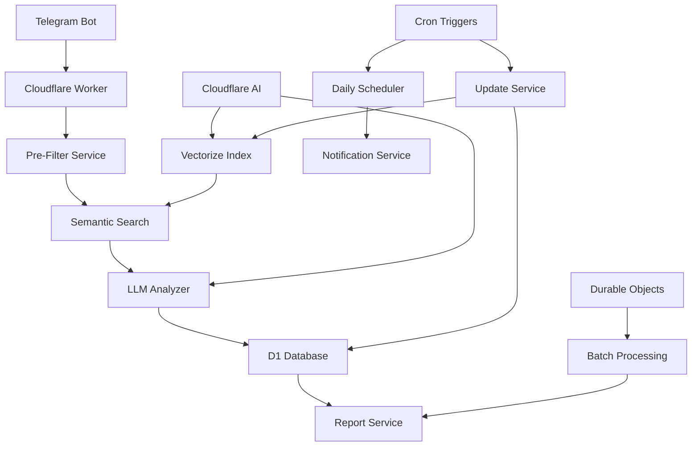

# Design Document

## Overview

Система анализа сообщений на предмет нарушений УК РФ представляет собой многоуровневую архитектуру, которая эффективно обрабатывает сообщения в реальном времени, используя комбинацию предварительной фильтрации, семантического поиска и LLM-анализа для точного определения потенциальных правонарушений.

## Architecture

### High-Level Architecture



### Cloudflare-Specific Architecture

**Основные компоненты:**
- **Cloudflare Worker** - основная логика обработки сообщений
- **D1 Database** - хранение статей УК РФ, результатов анализа и статистики
- **Vectorize Index** - векторные эмбеддинги статей УК РФ для семантического поиска
- **Cloudflare AI** - генерация эмбеддингов и LLM анализ нарушений
- **Durable Objects** - управление состоянием и батчинг сообщений
- **Cron Triggers** - ежедневная генерация отчетов и обновление УК РФ

### Component Architecture

1. **Message Processing Pipeline**
   - **Cloudflare Worker** - синхронная обработка входящих сообщений
   - **Durable Objects** - управление состоянием для батчинга и очередей
   - **Pre-Filter** для быстрой классификации
   - **Semantic Search** через Vectorize для поиска релевантных статей УК РФ
   - **LLM Analyzer** через Cloudflare AI для детального анализа

2. **Criminal Code Management**
   - **D1 Database** - структурированное хранение статей УК РФ с метаданными
   - **Vectorize Index** - векторные эмбеддинги статей для семантического поиска
   - **Cloudflare AI** - генерация эмбеддингов при загрузке новых статей
   - **Cron Triggers** - автоматическое обновление УК РФ (еженедельно)

3. **Data Storage & Reporting**
   - **D1 Database** - анонимизированное хранение результатов анализа
   - **Durable Objects** - агрегация данных для отчетов
   - **Cron Triggers** - ежедневная генерация отчетов

## Telegram Integration & Data Formats

### 1. Telegram Bot Integration

```typescript
interface TelegramIntegration {
  // Обработка входящих сообщений
  handleIncomingMessage(update: TelegramUpdate): Promise<void>;
  
  // Отправка ежедневных отчетов
  sendDailyReport(chatId: string, report: DailyReport): Promise<void>;
  
  // Уведомления о критических нарушениях
  sendCriticalAlert(chatId: string, violation: CriticalViolation): Promise<void>;
}

interface TelegramUpdate {
  message: {
    message_id: number;
    from: {
      id: number;
      username?: string;
      first_name: string;
    };
    chat: {
      id: number;
      type: 'private' | 'group' | 'supergroup';
    };
    text: string;
    date: number;
  };
}
```

### 2. Message Processing Data Flow

```typescript
// Входящие данные от Telegram
interface IncomingMessage {
  messageId: number;
  userId: number;
  chatId: number;
  text: string;
  timestamp: Date;
  replyToMessage?: IncomingMessage;
}

// Данные для анализа (анонимизированные)
interface AnalysisInput {
  messageHash: string;
  userHash: string;
  chatHash: string;
  text: string;
  context: ContextData;
  timestamp: Date;
}

// Результат анализа
interface AnalysisOutput {
  messageHash: string;
  isViolation: boolean;
  confidence: number;
  severity: SeverityLevel;
  violatedArticles: ViolatedArticle[];
  reasoning: string;
  processingTime: number;
}

// Формат ежедневного отчета для Telegram
interface TelegramDailyReport {
  date: string;
  summary: {
    totalMessages: number;
    violationsFound: number;
    criticalViolations: number;
  };
  topViolators: Array<{
    userHash: string; // Для админов - можно раскрыть
    violationCount: number;
    severityBreakdown: Record<SeverityLevel, number>;
  }>;
  topArticles: Array<{
    articleNumber: string;
    title: string;
    violationCount: number;
  }>;
  criticalCases: CriticalCase[];
}
```

### 3. LLM Prompt Templates

```typescript
const PROMPT_TEMPLATES = {
  contextAnalysis: `
Проанализируй контекст сообщения в Telegram чате:

Текущее сообщение: "{message}"
Предыдущие сообщения:
{previousMessages}

Определи:
1. Тон беседы (серьезный/шутливый/агрессивный/нейтральный)
2. Намерения автора (угроза/шутка/выражение_эмоций/обсуждение)
3. Контекст отношений между участниками

Ответь в JSON формате:
{
  "tone": "serious|joking|aggressive|neutral",
  "intent": "threat|joke|expression|discussion",
  "confidence": 0.0-1.0,
  "reasoning": "объяснение"
}
`,

  violationAnalysis: `
Определи нарушения УК РФ в сообщении:

Сообщение: "{message}"
Контекст: {contextAnalysis}

Релевантные статьи УК РФ:
{relevantArticles}

Учитывай:
- Различие между шуткой и реальной угрозой
- Контекст Telegram чата (неформальное общение)
- Культурные особенности и интернет-сленг
- Конкретность угроз и намерений

Для каждой статьи оцени:
- Применимость (0-100%)
- Обоснование
- Возможное наказание

Ответь в JSON:
{
  "isViolation": boolean,
  "confidence": 0.0-1.0,
  "articles": [
    {
      "number": "105",
      "applicability": 85,
      "reasoning": "...",
      "penalty": "лишение свободы на срок от 6 до 15 лет"
    }
  ],
  "overallReasoning": "общее обоснование"
}
`,

  severityAssessment: `
Оцени серьезность нарушения по 4-уровневой шкале:

Анализ нарушения: {violationAnalysis}
Контекст: {contextAnalysis}

Критерии:
- НИЗКАЯ: Неоднозначные выражения, вероятные шутки
- СРЕДНЯЯ: Серьезные высказывания без деталей
- ВЫСОКАЯ: Прямые угрозы с деталями
- КРИТИЧЕСКАЯ: Детальные планы, экстремизм

JSON ответ:
{
  "severity": "LOW|MEDIUM|HIGH|CRITICAL",
  "confidence": 0.0-1.0,
  "reasoning": "обоснование оценки"
}
`
};
```

## Vectorize Integration

### 1. Semantic Search via Vectorize

```typescript
interface VectorizeSemanticSearch {
  // Загрузка эмбеддингов статей в Vectorize
  upsertArticleEmbeddings(articles: CriminalCodeEntry[]): Promise<void>;
  
  // Семантический поиск похожих статей
  findSimilarArticles(queryText: string, limit: number): Promise<VectorSearchResult[]>;
  
  // Генерация эмбеддинга для запроса
  generateQueryEmbedding(text: string): Promise<number[]>;
}

interface VectorSearchResult {
  articleNumber: string;
  similarity: number;
  metadata: {
    title: string;
    category: string;
    severity: string;
    keywords: string;
  };
}

// Процесс семантического поиска:
// 1. Пользовательское сообщение → Cloudflare AI → эмбеддинг запроса
// 2. Vectorize.query(embedding, topK=5) → похожие статьи
// 3. Получение полной информации статей из D1
// 4. Возврат ранжированного списка релевантных статей
```

### 2. Cloudflare AI Integration

```typescript
interface CloudflareAIService {
  // Генерация эмбеддингов для текста
  generateEmbedding(text: string): Promise<number[]>;
  
  // LLM анализ нарушений УК РФ
  analyzeViolation(
    message: string,
    context: ContextResult,
    relevantArticles: Article[]
  ): Promise<ViolationAnalysis>;
  
  // Анализ контекста и намерений
  analyzeContext(
    message: string,
    previousMessages: Message[]
  ): Promise<ContextResult>;
}

// Используемые модели:
// - @cf/baai/bge-base-en-v1.5 для эмбеддингов (384 dimensions)
// - @cf/meta/llama-3.1-8b-instruct-fast для анализа текста
```

## Components and Interfaces

### 1. Criminal Code Manager

```typescript
interface CriminalCodeManager {
  // Обновление УК РФ
  updateCriminalCode(): Promise<void>;
  
  // Поиск релевантных статей
  findRelevantArticles(messageText: string, limit: number): Promise<Article[]>;
  
  // Получение полного текста статьи
  getArticleDetails(articleNumber: string): Promise<ArticleDetails>;
  
  // Проверка актуальности
  checkForUpdates(): Promise<boolean>;
}

interface Article {
  number: string;
  title: string;
  content: string;
  category: string;
  maxPenalty: string;
  similarity: number;
}
```

### 2. Message Pre-Filter

```typescript
interface MessagePreFilter {
  // Быстрая классификация сообщения
  classifyMessage(message: string): Promise<FilterResult>;
  
  // Извлечение потенциально проблематичных фраз
  extractSuspiciousPatterns(message: string): string[];
}

interface FilterResult {
  isPotentiallyProblematic: boolean;
  confidence: number;
  suspiciousPatterns: string[];
  category: 'safe' | 'suspicious' | 'problematic';
}
```

### 3. Context Analyzer

```typescript
interface ContextAnalyzer {
  // Анализ контекста беседы
  analyzeContext(
    currentMessage: string,
    previousMessages: Message[],
    userHistory: UserHistory
  ): Promise<ContextResult>;
  
  // Определение тона и намерений
  analyzeToneAndIntent(message: string, context: ContextResult): Promise<IntentResult>;
}

interface ContextResult {
  conversationTone: 'serious' | 'joking' | 'aggressive' | 'neutral';
  topicContext: string;
  relationshipDynamic: 'friendly' | 'hostile' | 'unknown';
}

interface IntentResult {
  intent: 'threat' | 'joke' | 'expression' | 'discussion';
  confidence: number;
  reasoning: string;
}
```

### 4. LLM Criminal Analyzer

```typescript
interface CriminalAnalyzer {
  // Основной анализ на нарушения УК РФ
  analyzeViolation(
    message: string,
    relevantArticles: Article[],
    context: ContextResult,
    intent: IntentResult
  ): Promise<ViolationResult>;
  
  // Определение серьезности нарушения
  assessSeverity(violation: ViolationResult): Promise<SeverityLevel>;
}

interface ViolationResult {
  isViolation: boolean;
  confidence: number;
  articles: ViolatedArticle[];
  reasoning: string;
  contextualFactors: string[];
}

interface ViolatedArticle {
  number: string;
  title: string;
  applicability: number; // 0-1
  potentialPenalty: string;
  mitigatingFactors: string[];
  aggravatingFactors: string[];
}

type SeverityLevel = 'LOW' | 'MEDIUM' | 'HIGH' | 'CRITICAL';
```

### 5. Report Generator

```typescript
interface ReportGenerator {
  // Генерация ежедневного отчета
  generateDailyReport(date: Date): Promise<DailyReport>;
  
  // Генерация отчета по пользователю
  generateUserReport(userId: string, period: DateRange): Promise<UserReport>;
  
  // Статистика по типам нарушений
  generateViolationStats(period: DateRange): Promise<ViolationStats>;
}

interface DailyReport {
  date: Date;
  totalMessages: number;
  analyzedMessages: number;
  violationsFound: number;
  userViolations: UserViolationSummary[];
  severityBreakdown: Record<SeverityLevel, number>;
  topViolations: ViolationSummary[];
}
```

## Data Models

### 1. Criminal Code Storage

```typescript
interface CriminalCodeEntry {
  id: string;
  articleNumber: string;
  title: string;
  content: string;
  category: string;
  subcategory: string;
  penalties: Penalty[];
  lastUpdated: Date;
  embedding: number[]; // Векторное представление для семантического поиска
}

interface Penalty {
  type: 'fine' | 'imprisonment' | 'community_service' | 'restriction';
  minValue?: string;
  maxValue?: string;
  description: string;
}
```

### 2. Message Analysis Storage

```typescript
interface MessageAnalysis {
  id: string;
  messageHash: string; // Хеш сообщения для анонимности
  userHash: string; // Хешированный user_id
  chatHash: string; // Хешированный chat_id
  timestamp: Date;
  
  // Результаты анализа
  preFilterResult: FilterResult;
  contextAnalysis: ContextResult;
  intentAnalysis: IntentResult;
  violationResult: ViolationResult;
  severityLevel: SeverityLevel;
  
  // Метаданные
  processingTime: number;
  confidence: number;
  reviewStatus: 'pending' | 'reviewed' | 'dismissed';
  reviewerNotes?: string;
}
```

### 3. Daily Statistics

```typescript
interface DailyStats {
  date: Date;
  totalMessages: number;
  analyzedMessages: number;
  violationsFound: number;
  falsePositives: number;
  processingTimeAvg: number;
  severityBreakdown: Record<SeverityLevel, number>;
  topArticles: Array<{articleNumber: string, count: number}>;
}
```

## Error Handling

### 1. Criminal Code Update Failures

```typescript
class CriminalCodeUpdateError extends Error {
  constructor(
    message: string,
    public readonly source: 'network' | 'parsing' | 'storage',
    public readonly retryable: boolean
  ) {
    super(message);
  }
}

// Стратегия обработки:
// 1. Retry с экспоненциальной задержкой для network ошибок
// 2. Fallback на кэшированную версию при критических ошибках
// 3. Уведомление администратора при длительной недоступности обновлений
```

### 2. LLM Analysis Failures

```typescript
class AnalysisError extends Error {
  constructor(
    message: string,
    public readonly messageId: string,
    public readonly stage: 'prefilter' | 'context' | 'llm' | 'storage'
  ) {
    super(message);
  }
}

// Стратегия обработки:
// 1. Retry анализа с упрощенным промптом
// 2. Fallback на rule-based анализ для критических случаев
// 3. Сохранение сообщения в очередь для повторной обработки
```

### 3. Performance Degradation

```typescript
interface PerformanceMonitor {
  checkSystemHealth(): Promise<HealthStatus>;
  handleOverload(): Promise<void>;
  scaleResources(): Promise<void>;
}

// Стратегии:
// 1. Приоритизация сообщений по важности
// 2. Временное отключение менее критичных проверок
// 3. Автоматическое масштабирование ресурсов
```

## Testing Strategy

### 1. Unit Testing

- **Criminal Code Manager**: Тестирование парсинга, поиска, обновлений
- **Message Filters**: Тестирование классификации с различными типами сообщений
- **Context Analyzer**: Тестирование определения тона и намерений
- **LLM Analyzer**: Мок-тестирование с предопределенными ответами

### 2. Integration Testing

- **End-to-End Pipeline**: Полный цикл от получения сообщения до генерации отчета
- **Criminal Code Updates**: Тестирование процесса обновления и миграции данных
- **Performance Testing**: Нагрузочное тестирование с большим объемом сообщений

### 3. Accuracy Testing

```typescript
interface AccuracyTestCase {
  message: string;
  context: Message[];
  expectedViolation: boolean;
  expectedArticles: string[];
  expectedSeverity: SeverityLevel;
  reasoning: string;
}

// Тестовые наборы:
// 1. Очевидные нарушения (прямые угрозы)
// 2. Пограничные случаи (шутки, сарказм)
// 3. Ложные срабатывания (безобидные сообщения)
// 4. Контекстуально-зависимые случаи
```

### 4. Privacy & Security Testing

- **Data Anonymization**: Проверка корректности хеширования и анонимизации
- **Data Retention**: Тестирование автоматического удаления устаревших данных
- **Access Control**: Проверка ограничений доступа к отчетам

## Cloudflare-Specific Implementation

### 1. Worker Limitations & Solutions

```typescript
// Ограничения Cloudflare Workers:
// - CPU time: 50ms (бесплатный план) / 30s (платный)
// - Memory: 128MB
// - Subrequest limit: 50 (бесплатный) / 1000 (платный)

interface WorkerOptimizations {
  // Быстрая предфильтрация для экономии CPU
  quickPreFilter(message: string): boolean;
  
  // Кэширование в KV для минимизации вычислений
  getCachedAnalysis(messageHash: string): Promise<CachedResult | null>;
  
  // Батчинг через Durable Objects
  batchMessage(message: MessageData): Promise<void>;
}
```

### 2. Durable Objects for State Management

```typescript
export class CriminalAnalysisBatcher {
  constructor(private state: DurableObjectState) {}
  
  // Накопление сообщений для батчинга
  async addMessage(message: MessageData): Promise<void> {
    const batch = await this.state.storage.get<MessageData[]>('currentBatch') || [];
    batch.push(message);
    
    if (batch.length >= 10 || this.shouldFlushBatch()) {
      await this.processBatch(batch);
      await this.state.storage.delete('currentBatch');
    } else {
      await this.state.storage.put('currentBatch', batch);
    }
  }
  
  // Обработка батча сообщений
  private async processBatch(messages: MessageData[]): Promise<void> {
    // Групповой анализ для оптимизации
  }
}
```

### 3. KV Storage Strategy

```typescript
interface KVStorageStrategy {
  // Структура хранения УК РФ в KV
  criminalCode: {
    'article:${articleNumber}': CriminalCodeEntry;
    'embedding:${articleNumber}': number[];
    'metadata:version': string;
    'metadata:lastUpdate': string;
  };
  
  // Кэширование результатов анализа
  analysisCache: {
    'analysis:${messageHash}': CachedAnalysisResult;
  };
  
  // Конфигурация системы
  config: {
    'config:sensitivity': SensitivityLevel;
    'config:enabledArticles': string[];
  };
}
```

### 4. Cloudflare Workers Main Handler

```typescript
export default {
  async fetch(request: Request, env: Env): Promise<Response> {
    const url = new URL(request.url);
    
    // Telegram webhook endpoint
    if (url.pathname === '/webhook' && request.method === 'POST') {
      const update: TelegramUpdate = await request.json();
      await handleTelegramUpdate(update, env);
      return new Response('OK');
    }
    
    // Health check endpoint
    if (url.pathname === '/health') {
      return new Response('OK');
    }
    
    return new Response('Not Found', { status: 404 });
  },

  // Cron trigger for daily reports
  async scheduled(event: ScheduledEvent, env: Env): Promise<void> {
    if (event.cron === '0 0 * * *') { // Daily at midnight
      await generateAndSendDailyReports(env);
    }
    
    if (event.cron === '0 2 * * 0') { // Weekly on Sunday at 2 AM
      await updateCriminalCodeData(env);
    }
  }
};

async function handleTelegramUpdate(update: TelegramUpdate, env: Env): Promise<void> {
  if (!update.message?.text) return;
  
  // Create analysis input
  const analysisInput: AnalysisInput = {
    messageHash: await hashMessage(update.message.text),
    userHash: await hashUserId(update.message.from.id),
    chatHash: await hashChatId(update.message.chat.id),
    text: update.message.text,
    context: await getMessageContext(update, env),
    timestamp: new Date(update.message.date * 1000)
  };
  
  // Process through analysis pipeline
  const result = await analyzeMessage(analysisInput, env);
  
  // Store results
  await storeAnalysisResult(result, env);
  
  // Send immediate alert for critical violations
  if (result.severity === 'CRITICAL') {
    await sendCriticalAlert(update.message.chat.id, result, env);
  }
}
```

### 5. D1 Database Schema

```sql
-- Результаты анализа сообщений
CREATE TABLE message_analyses (
  id TEXT PRIMARY KEY,
  message_hash TEXT NOT NULL,
  user_hash TEXT NOT NULL,
  chat_hash TEXT NOT NULL,
  timestamp DATETIME NOT NULL,
  violation_found BOOLEAN NOT NULL,
  severity_level TEXT,
  articles_violated TEXT, -- JSON array
  confidence REAL,
  processing_time_ms INTEGER,
  review_status TEXT DEFAULT 'pending',
  context_data TEXT, -- JSON with tone, intent analysis
  llm_reasoning TEXT
);

-- Ежедневная статистика
CREATE TABLE daily_stats (
  date DATE PRIMARY KEY,
  total_messages INTEGER,
  analyzed_messages INTEGER,
  violations_found INTEGER,
  avg_processing_time REAL,
  severity_breakdown TEXT, -- JSON object
  top_articles TEXT, -- JSON array
  chat_breakdown TEXT -- JSON object with per-chat stats
);

-- Версионирование УК РФ
CREATE TABLE criminal_code_versions (
  version TEXT PRIMARY KEY,
  source TEXT NOT NULL,
  updated_at DATETIME NOT NULL,
  articles_count INTEGER,
  checksum TEXT,
  scraping_success BOOLEAN DEFAULT TRUE
);

-- Конфигурация системы
CREATE TABLE system_config (
  key TEXT PRIMARY KEY,
  value TEXT NOT NULL,
  updated_at DATETIME DEFAULT CURRENT_TIMESTAMP
);
```

### 6. Vectorize Index Structure

```typescript
interface VectorizeIndexStructure {
  // Векторы статей УК РФ
  vectors: Array<{
    id: string; // article number (e.g., "105", "119")
    values: number[]; // 384-dimensional embedding from Cloudflare AI
    metadata: {
      title: string;
      category: string;
      severity: 'LOW' | 'MEDIUM' | 'HIGH' | 'CRITICAL';
      keywords: string; // comma-separated keywords
    };
  }>;
}

// Конфигурация Vectorize индекса:
// - dimensions: 384 (совместимо с @cf/baai/bge-base-en-v1.5)
// - metric: cosine (для семантического сходства)
// - namespace: criminal-code-index

// Пример использования:
// await env.VECTORIZE.upsert([{
//   id: "105",
//   values: [0.1, 0.2, ...], // 384 numbers
//   metadata: {
//     title: "Убийство",
//     category: "crimes_against_person",
//     severity: "HIGH",
//     keywords: "убийство, смерть, умышленное причинение смерти"
//   }
// }]);
```

### 7. D1 Database Schema (Updated)

```sql
-- Статьи УК РФ (без поля embedding - теперь в Vectorize)
CREATE TABLE criminal_articles (
  number TEXT PRIMARY KEY,
  title TEXT NOT NULL,
  content TEXT NOT NULL,
  category TEXT NOT NULL,
  subcategory TEXT,
  severity TEXT NOT NULL,
  keywords TEXT NOT NULL, -- JSON array
  related_articles TEXT, -- JSON array
  created_at DATETIME DEFAULT CURRENT_TIMESTAMP,
  updated_at DATETIME DEFAULT CURRENT_TIMESTAMP
);

-- Остальные таблицы без изменений...
```

## Performance Considerations

### 1. Cloudflare-Specific Optimizations

- **Vectorize Performance**: Высокоскоростной семантический поиск через специализированную векторную БД
- **D1 Caching**: Кэширование часто запрашиваемых статей УК РФ
- **Durable Objects Batching**: Группировка сообщений для снижения нагрузки
- **CPU Time Management**: Быстрая предфильтрация для экономии CPU времени
- **AI Model Optimization**: Использование быстрых моделей для эмбеддингов и анализа

### 2. Scalability within Cloudflare

- **Global Distribution**: Автоматическое масштабирование через Cloudflare Edge
- **Vectorize Auto-scaling**: Автоматическое масштабирование векторного поиска
- **Durable Objects Coordination**: Распределение нагрузки между DO экземплярами
- **D1 Read Replicas**: Распределенное чтение данных статей УК РФ

### 3. Latency Optimization

- **Vectorize Edge Deployment**: Векторный поиск на Edge серверах
- **Semantic Search Speed**: Оптимизированные алгоритмы поиска в Vectorize
- **AI Model Caching**: Кэширование результатов AI моделей
- **LLM Prompt Optimization**: Минимизация размера промптов для экономии времени

## Criminal Code Data Sources & Management

### 1. Available Data Sources

После исследования доступных источников УК РФ:

```typescript
interface CriminalCodeSource {
  name: string;
  url: string;
  format: 'html' | 'json' | 'api';
  accessType: 'free' | 'paid' | 'scraping';
  updateFrequency: 'manual' | 'weekly' | 'monthly';
  priority: number;
  reliability: number;
}

// Реально доступные источники:
const AVAILABLE_SOURCES: CriminalCodeSource[] = [
  {
    name: 'Kodeks Karelia (scraping)',
    url: 'http://kodeks.karelia.ru/api/show/9017477',
    format: 'html',
    accessType: 'scraping',
    updateFrequency: 'weekly',
    priority: 1,
    reliability: 0.95
  },
  {
    name: 'Pravo.gov.ru (official)',
    url: 'http://pravo.gov.ru/proxy/ips/?docbody=&nd=102041891',
    format: 'html',
    accessType: 'free',
    updateFrequency: 'manual',
    priority: 2,
    reliability: 1.0
  },
  {
    name: 'Consultant.ru (scraping)',
    url: 'http://www.consultant.ru/document/cons_doc_LAW_10699/',
    format: 'html',
    accessType: 'scraping',
    updateFrequency: 'weekly',
    priority: 3,
    reliability: 0.9
  },
  {
    name: 'Static Fallback',
    url: 'local://criminal-code-backup.json',
    format: 'json',
    accessType: 'free',
    updateFrequency: 'manual',
    priority: 4,
    reliability: 0.8
  }
];
```

### 2. Data Acquisition Strategy

```typescript
interface DataAcquisitionStrategy {
  // Основная стратегия - API kodeks.karelia.ru
  fetchFromKodeksAPI(): Promise<APIResult>;
  
  // Резервная стратегия - веб-скрапинг официальных источников
  scrapePrimarySource(): Promise<ScrapingResult>;
  
  // Fallback - статичная копия УК РФ в репозитории
  loadStaticFallback(): Promise<StaticData>;
  
  // Валидация и сравнение источников
  validateAndMerge(sources: DataSource[]): Promise<ValidatedData>;
}

interface APIResult {
  articles: ParsedArticle[];
  lastModified: Date;
  source: 'kodeks_api';
  version: string;
  confidence: number;
}

// Специфичный парсер для Kodeks Karelia
class KodeksKareliaScraper {
  async fetchCriminalCode(): Promise<CriminalCodeData> {
    const response = await fetch('http://kodeks.karelia.ru/api/show/9017477');
    const html = await response.text();
    
    return this.parseKodeksHTML(html);
  }
  
  private parseKodeksHTML(html: string): CriminalCodeData {
    // Парсинг HTML страницы с УК РФ
    // Поиск паттернов: "Статья XXX.", заголовки, содержание, санкции
    const articles = this.extractArticlesFromHTML(html);
    
    return {
      articles,
      metadata: {
        source: 'kodeks.karelia.ru',
        scrapedAt: new Date(),
        totalArticles: articles.length
      },
      lastUpdated: new Date()
    };
  }
  
  private extractArticlesFromHTML(html: string): ParsedArticle[] {
    // Логика парсинга HTML:
    // 1. Найти все блоки со статьями (регулярные выражения)
    // 2. Извлечь номер статьи, заголовок, содержание
    // 3. Определить санкции (штраф, лишение свободы и т.д.)
    
    const articlePattern = /Статья\s+(\d+(?:\.\d+)?)\.\s*([^<]+)/g;
    const articles: ParsedArticle[] = [];
    
    // Парсинг каждой статьи...
    return articles;
  }
}
```

### 3. Web Scraping Implementation

```typescript
// Парсер для Consultant.ru
class ConsultantScraper {
  async scrapeArticles(): Promise<ParsedArticle[]> {
    const response = await fetch('http://www.consultant.ru/document/cons_doc_LAW_10699/');
    const html = await response.text();
    
    // Парсинг HTML структуры
    return this.parseConsultantHTML(html);
  }
  
  private parseConsultantHTML(html: string): ParsedArticle[] {
    // Логика парсинга статей из HTML
    // Поиск паттернов: "Статья XXX", содержание, санкции
  }
}

// Парсер для pravo.gov.ru
class PravoGovScraper {
  async scrapeArticles(): Promise<ParsedArticle[]> {
    // Официальный источник - более надежный, но может требовать
    // более сложного парсинга
  }
}
```

### 4. Hybrid Approach - Static + Updates

```typescript
// Гибридный подход: статичная база + инкрементальные обновления
interface HybridDataManager {
  // Загрузка базовой версии УК РФ из статичного файла
  loadBaseVersion(): Promise<CriminalCodeEntry[]>;
  
  // Проверка обновлений через веб-скрапинг
  checkForUpdates(): Promise<UpdateResult>;
  
  // Применение инкрементальных обновлений
  applyUpdates(updates: ArticleUpdate[]): Promise<void>;
  
  // Полная пересинхронизация (раз в месяц)
  fullResync(): Promise<void>;
}

interface ArticleUpdate {
  articleNumber: string;
  changeType: 'added' | 'modified' | 'deleted';
  newContent?: string;
  effectiveDate: Date;
}
```

### 2. Data Processing Pipeline

```typescript
interface CriminalCodeProcessor {
  // Парсинг различных форматов
  parseXML(content: string): Promise<ParsedArticle[]>;
  parseJSON(content: string): Promise<ParsedArticle[]>;
  parseHTML(content: string): Promise<ParsedArticle[]>;
  
  // Нормализация данных
  normalizeArticles(articles: ParsedArticle[]): Promise<CriminalCodeEntry[]>;
  
  // Векторизация для семантического поиска
  generateEmbeddings(articles: CriminalCodeEntry[]): Promise<void>;
  
  // Валидация целостности
  validateIntegrity(articles: CriminalCodeEntry[]): Promise<ValidationResult>;
}
```

### 3. Semantic Search Implementation

```typescript
interface SemanticSearchEngine {
  // Создание векторных индексов
  buildIndex(articles: CriminalCodeEntry[]): Promise<void>;
  
  // Поиск похожих статей
  findSimilar(query: string, limit: number, threshold: number): Promise<SearchResult[]>;
  
  // Обновление индекса
  updateIndex(newArticles: CriminalCodeEntry[]): Promise<void>;
}

interface SearchResult {
  article: CriminalCodeEntry;
  similarity: number;
  relevanceScore: number;
  matchedTerms: string[];
}

// Алгоритм семантического поиска:
// 1. Векторизация запроса (сообщения пользователя)
// 2. Косинусное сходство с векторами статей УК РФ
// 3. Фильтрация по порогу релевантности (>0.7)
// 4. Ранжирование по комбинированному скору
```

## LLM Analysis Algorithms

### 1. Multi-Stage Analysis Pipeline

```typescript
interface AnalysisPipeline {
  // Этап 1: Предварительная фильтрация
  stage1_PreFilter(message: string): Promise<PreFilterResult>;
  
  // Этап 2: Контекстуальный анализ
  stage2_ContextAnalysis(
    message: string, 
    context: Message[], 
    preFilterResult: PreFilterResult
  ): Promise<ContextAnalysisResult>;
  
  // Этап 3: Семантический поиск статей
  stage3_ArticleSearch(
    message: string, 
    contextResult: ContextAnalysisResult
  ): Promise<Article[]>;
  
  // Этап 4: Детальный LLM анализ
  stage4_LLMAnalysis(
    message: string,
    context: ContextAnalysisResult,
    articles: Article[]
  ): Promise<ViolationAnalysis>;
  
  // Этап 5: Оценка серьезности
  stage5_SeverityAssessment(
    analysis: ViolationAnalysis
  ): Promise<FinalResult>;
}
```

### 2. LLM Prompt Engineering

```typescript
const ANALYSIS_PROMPTS = {
  contextAnalysis: `
    Проанализируй контекст сообщения и определи:
    1. Тон беседы (серьезный/шутливый/агрессивный/нейтральный)
    2. Намерения автора (угроза/шутка/выражение эмоций/обсуждение)
    3. Уровень серьезности высказывания
    
    Сообщение: "{message}"
    Предыдущие сообщения: {context}
    
    Ответь в формате JSON с обоснованием.
  `,
  
  violationAnalysis: `
    Определи, нарушает ли данное сообщение статьи УК РФ:
    
    Сообщение: "{message}"
    Контекст: {contextAnalysis}
    Релевантные статьи УК РФ: {articles}
    
    Учти:
    - Контекст и намерения автора
    - Различие между шуткой и реальной угрозой
    - Конкретность и детализацию угроз
    - Культурные особенности и сленг
    
    Для каждой потенциально нарушенной статьи укажи:
    - Применимость (0-100%)
    - Обоснование
    - Смягчающие/отягчающие факторы
    - Возможное наказание
  `,
  
  severityAssessment: `
    Оцени серьезность нарушения по шкале:
    - НИЗКАЯ: Неоднозначные выражения, возможные шутки
    - СРЕДНЯЯ: Серьезные высказывания без конкретных деталей
    - ВЫСОКАЯ: Прямые угрозы с деталями, призывы к действиям
    - КРИТИЧЕСКАЯ: Детальные планы, экстремистские призывы
    
    Анализ: {violationAnalysis}
    
    Обоснуй свою оценку.
  `
};
```

### 3. Confidence Scoring Algorithm

```typescript
interface ConfidenceCalculator {
  calculateOverallConfidence(
    preFilterConfidence: number,
    contextConfidence: number,
    llmConfidence: number,
    articleRelevance: number[]
  ): number;
}

// Алгоритм расчета уверенности:
// confidence = (
//   preFilterConfidence * 0.2 +
//   contextConfidence * 0.3 +
//   llmConfidence * 0.4 +
//   avgArticleRelevance * 0.1
// ) * consistencyBonus

// consistencyBonus = 1.0 если все этапы согласованы
// consistencyBonus = 0.8 если есть противоречия
```

## Security Considerations

### 1. Data Protection

- **Encryption**: Шифрование чувствительных данных в покое и при передаче
- **Anonymization**: Необратимое хеширование идентификаторов пользователей
- **Access Logging**: Логирование всех обращений к данным анализа

### 2. Criminal Code Integrity

- **Source Verification**: Проверка подлинности источников обновлений УК РФ
- **Version Control**: Отслеживание изменений в УК РФ с возможностью отката
- **Backup Strategy**: Регулярное резервное копирование базы УК РФ

### 3. System Security

- **Rate Limiting**: Ограничение частоты запросов к внешним API
- **Input Validation**: Валидация всех входящих данных
- **Error Information Leakage**: Предотвращение утечки системной информации через ошибки

## Practical Data Acquisition Plan

### 1. Initial Setup Strategy

```typescript
// Этап 1: Создание статичной базы УК РФ
const INITIAL_SETUP = {
  // Ручное создание базовой версии УК РФ из открытых источников
  manualDataEntry: {
    source: 'Consultant.ru + pravo.gov.ru',
    method: 'manual_extraction',
    coverage: 'key_articles_only', // Начинаем с основных статей
    articles: [
      // Статьи против личности (105-125)
      // Статьи против собственности (158-168)  
      // Статьи против общественной безопасности (205-227)
      // Экстремизм (280-282.4)
      // И т.д.
    ]
  },
  
  // Автоматизированное обновление
  automatedUpdates: {
    frequency: 'monthly',
    method: 'web_scraping',
    validation: 'manual_review'
  }
};
```

### 2. Incremental Data Collection

```typescript
interface IncrementalCollector {
  // Сбор данных по категориям статей
  collectByCategory(category: CrimeCategory): Promise<Article[]>;
  
  // Приоритизация наиболее важных статей
  prioritizeArticles(): ArticlePriority[];
  
  // Валидация через несколько источников
  crossValidate(article: Article): Promise<ValidationResult>;
}

enum CrimeCategory {
  VIOLENT_CRIMES = 'violent', // Статьи 105-125
  PROPERTY_CRIMES = 'property', // Статьи 158-168
  PUBLIC_SAFETY = 'safety', // Статьи 205-227
  EXTREMISM = 'extremism', // Статьи 280-282.4
  DRUG_CRIMES = 'drugs', // Статьи 228-234
  CORRUPTION = 'corruption' // Статьи 290-293
}
```

### 3. Fallback & Reliability Strategy

```typescript
// Многоуровневая система надежности
const RELIABILITY_STRATEGY = {
  level1: {
    source: 'Static JSON file in repository',
    reliability: 1.0,
    coverage: 'core_articles_only',
    updateMethod: 'manual_git_commits'
  },
  
  level2: {
    source: 'Web scraping pravo.gov.ru',
    reliability: 0.9,
    coverage: 'full_criminal_code',
    updateMethod: 'automated_monthly'
  },
  
  level3: {
    source: 'Community contributions',
    reliability: 0.7,
    coverage: 'extended_interpretations',
    updateMethod: 'pull_requests'
  }
};
```

### 4. Legal Compliance & Disclaimers

```typescript
interface LegalCompliance {
  // Дисклеймеры для пользователей
  disclaimers: {
    accuracy: 'Результаты анализа носят информационный характер';
    liability: 'Не является юридической консультацией';
    updates: 'Данные могут быть неактуальными';
  };
  
  // Ограничения ответственности
  limitations: {
    scope: 'Анализ основан на доступных данных УК РФ';
    interpretation: 'Требует профессиональной юридической оценки';
    context: 'Не учитывает все нюансы правоприменения';
  };
}
```

## Implementation Phases (Revised)

### Phase 1: Data Foundation (Weeks 1-2)
- **Week 1**: Интеграция с Kodeks API (http://kodeks.karelia.ru/api/show/9017477)
- **Week 2**: Парсинг и векторизация полученных данных УК РФ

### Phase 2: Core Analysis Engine (Weeks 4-5)
- **Week 4**: Базовая предфильтрация и семантический поиск
- **Week 5**: Интеграция с LLM для анализа нарушений

### Phase 3: Context & Severity Analysis (Weeks 6-7)
- **Week 6**: Контекстуальный анализатор (тон, намерения)
- **Week 7**: Система градации серьезности нарушений

### Phase 4: Reporting & Production (Weeks 8-9)
- **Week 8**: Генератор отчетов и система уведомлений
- **Week 9**: Тестирование, оптимизация, деплой

### Phase 5: Data Expansion (Ongoing)
- Постепенное расширение базы статей УК РФ
- Улучшение точности через обратную связь
- Автоматизация процесса обновлений