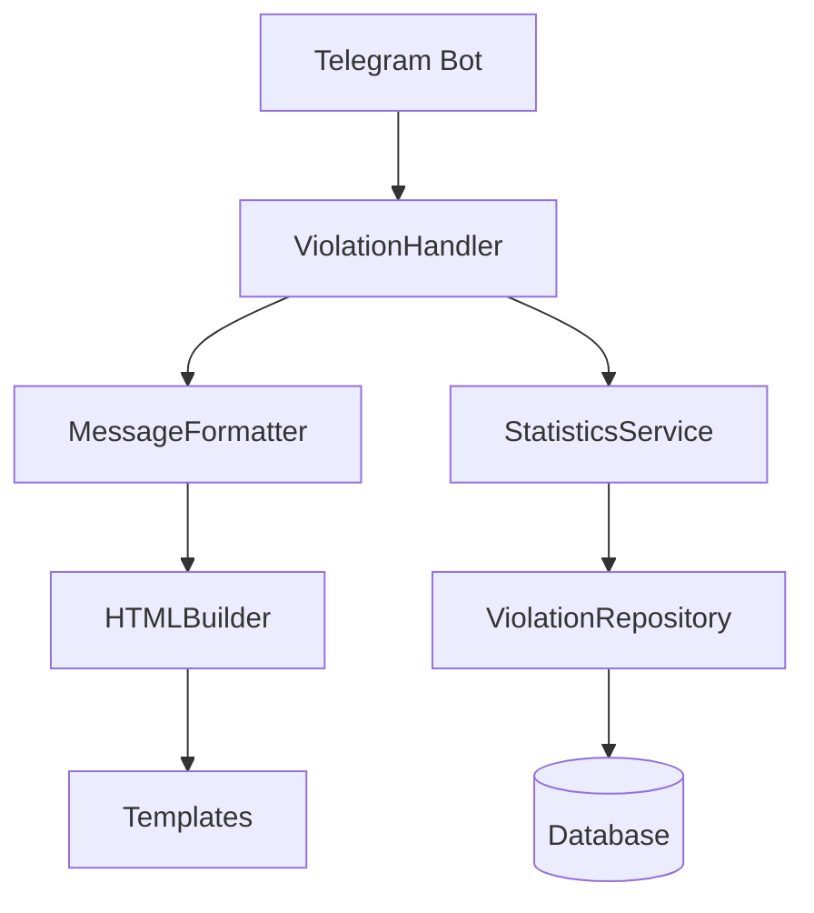
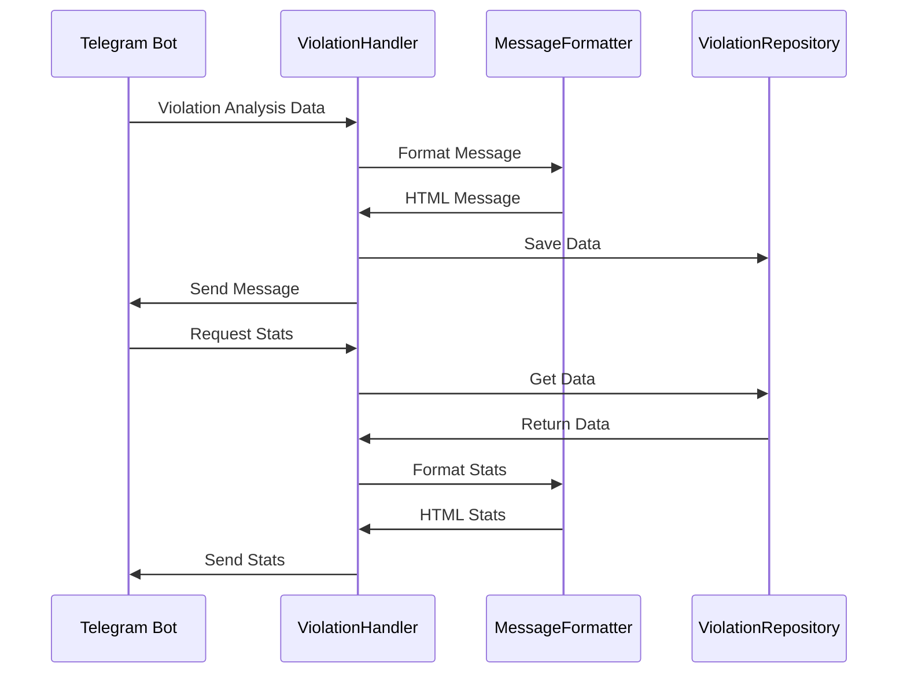

# Дизайн системы улучшенного отображения информации о нарушениях

## Обзор

Система предназначена для улучшения отображения информации о криминальных нарушениях в Telegram боте. Решение включает форматирование развернутых сообщений о нарушениях, генерацию статистических отчетов и использование HTML разметки для улучшения читаемости.

Основные возможности:
- Форматирование детальных сообщений о нарушениях с использованием всех доступных данных
- Генерация статистики по пользователям, периодам и общей активности
- HTML разметка для улучшения визуального представления
- Система эмодзи-индикаторов для быстрой оценки серьезности

## Архитектура

### Упрощенная диаграмма компонентов



### Упрощенный поток данных



## Компоненты и интерфейсы

### ViolationHandler

Простой обработчик для нарушений, расширяющий существующую функциональность.

**Интерфейс:**
```typescript
interface IViolationHandler {
  formatViolationMessage(analysis: ViolationAnalysis): string;
  getUserStats(userId: string, chatId: string): Promise<string>;
  getPeriodStats(chatId: string, days: number): Promise<string>;
  getGeneralStats(chatId: string): Promise<string>;
}
```

**Ответственности:**
- Обработка данных о нарушениях
- Форматирование сообщений
- Получение статистики

### MessageFormatter

Простой форматтер с HTML поддержкой.

**Интерфейс:**
```typescript
interface IMessageFormatter {
  formatViolation(violation: Violation): string;
  formatUserStats(stats: UserStats): string;
  formatPeriodStats(stats: PeriodStats): string;
  getSeverityEmoji(severity: number): string;
  escapeHtml(text: string): string;
}
```

**Ответственности:**
- HTML форматирование
- Эмодзи индикаторы
- Экранирование текста

### StatisticsService

Упрощенный сервис статистики.

**Интерфейс:**
```typescript
interface IStatisticsService {
  getUserStats(userId: string, chatId: string): Promise<UserStats>;
  getPeriodStats(chatId: string, days: number): Promise<PeriodStats>;
  getGeneralStats(chatId: string): Promise<GeneralStats>;
  saveViolation(violation: Violation, userId: string, chatId: string): Promise<void>;
}
```

### HTMLBuilder

Простой построитель HTML с базовыми шаблонами.

**Интерфейс:**
```typescript
interface IHTMLBuilder {
  buildViolationMessage(data: ViolationData): string;
  buildStatsMessage(data: StatsData): string;
  addEmoji(severity: number): string;
  bold(text: string): string;
  italic(text: string): string;
  code(text: string): string;
}
```

### ViolationRepository

Простое хранилище данных.

**Интерфейс:**
```typescript
interface IViolationRepository {
  save(violation: Violation, userId: string, chatId: string): Promise<void>;
  getUserViolations(userId: string, chatId: string): Promise<Violation[]>;
  getPeriodViolations(chatId: string, days: number): Promise<Violation[]>;
  getAllViolations(chatId: string): Promise<Violation[]>;
}
```

## Упрощенная интеграция

### Принципы упрощения

1. **Минимальные изменения:** Добавляем только необходимые компоненты
2. **Прямая интеграция:** Используем существующую архитектуру как основу
3. **Простые интерфейсы:** Избегаем сложных абстракций
4. **Быстрая реализация:** Фокус на функциональности, а не на архитектурной сложности

### Простой план интеграции

1. **Создать ViolationHandler** как расширение существующего обработчика
2. **Добавить MessageFormatter** для HTML форматирования
3. **Реализовать простую статистику** в существующей базе данных
4. **Интегрировать через существующие точки входа**

## Модели данных

### ViolationAnalysis

```typescript
interface ViolationAnalysis {
  hasViolations: boolean;
  violations: Violation[];
  totalSeverity: number;
  riskLevel: 'low' | 'medium' | 'high';
  analysisTimestamp: string;
}
```

### Violation

```typescript
interface Violation {
  article: string;
  quote: string;
  punishment: string;
  severity: number; // 1-10
  confidence: number; // 0-1
}
```

### UserStatistics

```typescript
interface UserStatistics {
  userId: string;
  chatId: string;
  totalViolations: number;
  violationsByArticle: Map<string, number>;
  averageSeverity: number;
  riskLevel: 'low' | 'medium' | 'high';
  lastViolationDate: Date;
  mostCommonViolation: string;
}
```

### PeriodStatistics

```typescript
interface PeriodStatistics {
  chatId: string;
  startDate: Date;
  endDate: Date;
  totalViolations: number;
  violationsByArticle: Map<string, number>;
  averageSeverity: number;
  uniqueUsers: number;
  comparisonWithPreviousPeriod: {
    violationsChange: number;
    severityChange: number;
  };
}
```

### GeneralStatistics

```typescript
interface GeneralStatistics {
  chatId: string;
  totalViolations: number;
  topViolations: ViolationCount[];
  topUsers: UserViolationCount[];
  overallRiskLevel: 'low' | 'medium' | 'high';
  averageSeverity: number;
  criticalViolations: Violation[];
}
```

## Обработка ошибок

### Валидация входных данных

1. **Проверка структуры ViolationAnalysis:**
   - Валидация обязательных полей
   - Проверка типов данных
   - Валидация диапазонов значений (severity: 1-10, confidence: 0-1)

2. **Обработка отсутствующих данных:**
   - Значения по умолчанию для необязательных полей
   - Fallback сообщения при отсутствии критических данных
   - Логирование предупреждений о неполных данных

3. **Обработка ошибок HTML разметки:**
   - Экранирование специальных символов
   - Валидация HTML тегов
   - Fallback к plain text при ошибках разметки

### Стратегии восстановления

1. **При ошибках форматирования:**
   - Отправка упрощенной версии сообщения
   - Логирование ошибки для анализа
   - Уведомление администратора при критических ошибках

2. **При ошибках базы данных:**
   - Retry механизм для временных сбоев
   - Кэширование для снижения нагрузки
   - Graceful degradation функциональности

## Стратегия тестирования

### Unit тесты

1. **ViolationFormatter тесты:**
   - Корректность HTML разметки
   - Правильность эмодзи-индикаторов
   - Обработка edge cases (пустые данные, экстремальные значения)

2. **StatisticsService тесты:**
   - Точность статистических вычислений
   - Корректность агрегации данных
   - Производительность на больших объемах данных

3. **HTMLTemplateEngine тесты:**
   - Валидность генерируемого HTML
   - Корректность экранирования
   - Производительность рендеринга

### Integration тесты

1. **Тесты взаимодействия с базой данных:**
   - Сохранение и извлечение данных
   - Транзакционность операций
   - Обработка конкурентного доступа

2. **End-to-end тесты:**
   - Полный цикл обработки нарушения
   - Генерация различных типов статистики
   - Корректность отображения в Telegram

### Тесты производительности

1. **Нагрузочные тесты:**
   - Обработка большого количества нарушений
   - Генерация статистики для активных чатов
   - Время отклика при пиковых нагрузках

2. **Тесты памяти:**
   - Утечки памяти при длительной работе
   - Эффективность кэширования
   - Оптимизация запросов к базе данных