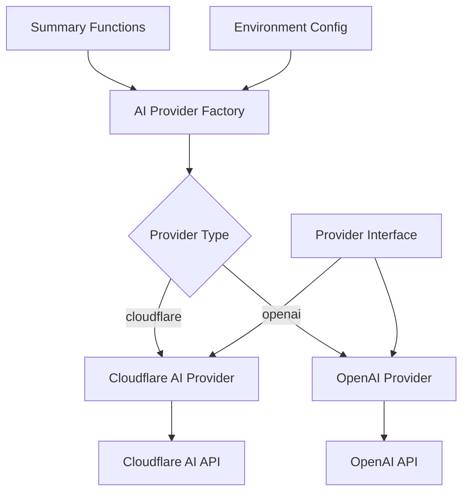

# Design Document

## Overview

Данный дизайн описывает архитектуру для добавления поддержки OpenAI API как альтернативного провайдера саммаризации в телеграм-боте. Решение основано на паттерне Strategy, который позволяет легко переключаться между провайдерами и добавлять новые в будущем.

Ключевые принципы дизайна:
- Минимальные изменения в существующем коде саммаризации
- Четкое разделение ответственности между провайдерами
- Единообразный интерфейс для всех провайдеров AI
- Простая конфигурация через переменные окружения

## Architecture

### High-Level Architecture



### Provider Strategy Pattern

Система использует паттерн Strategy для абстракции различных AI провайдеров:

```typescript
interface AIProvider {
  summarize(messages: ChatMessage[], options: SummaryOptions): Promise<string>;
  validateConfig(): void;
  getProviderInfo(): ProviderInfo;
}
```

## Components and Interfaces

### 1. AI Provider Interface

**Файл:** `src/providers/ai-provider.ts`

Базовый интерфейс для всех AI провайдеров:

```typescript
export const MESSAGE_SEPARATOR = "=== СООБЩЕНИЯ ===";

export interface ChatMessage {
  role: 'system' | 'user' | 'assistant';
  content: string;
}

export interface TelegramMessage {
  username: string;
  text: string;
  ts: number;
}

export interface SummaryRequest {
  messages: TelegramMessage[];
  systemPrompt?: string;
  userPrompt: string;
  limitNote: string;
}

export interface SummaryOptions {
  maxTokens: number;
  temperature: number;
  topP: number;
  frequencyPenalty?: number;
}

export interface ProviderInfo {
  name: string;
  model: string;
  version?: string;
}

export interface AIProvider {
  summarize(request: SummaryRequest, options: SummaryOptions): Promise<string>;
  validateConfig(): void;
  getProviderInfo(): ProviderInfo;
}
```

### 2. Cloudflare AI Provider

**Файл:** `src/providers/cloudflare-provider.ts`

Обертка для существующего Cloudflare AI функционала:

```typescript
export class CloudflareAIProvider implements AIProvider {
  constructor(private env: Env) {}
  
  async summarize(request: SummaryRequest, options: SummaryOptions): Promise<string> {
    // Форматирует сообщения в текст: "username: text"
    const content = request.messages.map(m => `${m.username}: ${m.text}`).join('\n');
    
    // Использует существующую логику buildChatMessages и env.AI.run()
    if (this.env.SUMMARY_MODEL.includes('chat')) {
      const messages = this.buildChatMessages(request, content);
      return await this.env.AI.run(this.env.SUMMARY_MODEL, { ...options, messages });
    } else {
      const input = `${request.userPrompt}\n${request.limitNote}\n${content}`;
      return await this.env.AI.run(this.env.SUMMARY_MODEL, { ...options, prompt: input });
    }
  }
  
  private buildChatMessages(request: SummaryRequest, content: string): ChatMessage[] {
    const system = request.systemPrompt 
      ? `${request.systemPrompt}\n${request.limitNote}`
      : request.limitNote;
    
    return [
      { role: 'system', content: system },
      { role: 'user', content: `${request.userPrompt}\n${MESSAGE_SEPARATOR}\n${content}` }
    ];
  }
  
  validateConfig(): void {
    if (!this.env.AI) throw new Error('AI binding is required for Cloudflare provider');
    if (!this.env.SUMMARY_MODEL) throw new Error('SUMMARY_MODEL is required');
  }
  
  getProviderInfo(): ProviderInfo {
    return {
      name: 'cloudflare',
      model: this.env.SUMMARY_MODEL
    };
  }
}
```

### 3. OpenAI Provider

**Файл:** `src/providers/openai-provider.ts`

Новый провайдер для OpenAI API:

```typescript
export class OpenAIProvider implements AIProvider {
  private apiKey: string;
  private model: string;
  private baseUrl: string = 'https://api.openai.com/v1';
  
  constructor(private env: Env) {
    this.apiKey = env.OPENAI_API_KEY;
    this.model = env.OPENAI_MODEL || 'gpt-3.5-turbo';
  }
  
  async summarize(request: SummaryRequest, options: SummaryOptions): Promise<string> {
    // Форматирует сообщения с сохранением информации об авторах
    const content = request.messages.map(m => `${m.username}: ${m.text}`).join('\n');
    
    const messages: ChatMessage[] = [
      { 
        role: 'system', 
        content: request.systemPrompt 
          ? `${request.systemPrompt}\n${request.limitNote}`
          : request.limitNote 
      },
      { 
        role: 'user', 
        content: `${request.userPrompt}\n${MESSAGE_SEPARATOR}\n${content}` 
      }
    ];
    
    const response = await this.callOpenAI(messages, options);
    return response.choices[0].message.content;
  }
  
  private async callOpenAI(messages: ChatMessage[], options: SummaryOptions): Promise<OpenAIChatResponse> {
    const requestBody: OpenAIChatRequest = {
      model: this.model,
      messages,
      ...(this.isGPT5Model(this.model) ? { max_completion_tokens: options.maxTokens } : { max_tokens: options.maxTokens }),
      temperature: options.temperature,
      top_p: options.topP,
      ...(options.frequencyPenalty !== undefined && { frequency_penalty: options.frequencyPenalty })
    };
    
    const response = await fetch(`${this.baseUrl}/chat/completions`, {
      method: 'POST',
      headers: {
        'Authorization': `Bearer ${this.apiKey}`,
        'Content-Type': 'application/json'
      },
      body: JSON.stringify(requestBody)
    });
    
    if (!response.ok) {
      throw new ProviderError(
        `OpenAI API error: ${response.status} ${response.statusText}`,
        'openai'
      );
    }
    
    return await response.json();
  }
  
  validateConfig(): void {
    if (!this.apiKey) {
      throw new Error('OPENAI_API_KEY is required for OpenAI provider');
    }
  }
  
  getProviderInfo(): ProviderInfo {
    return {
      name: 'openai',
      model: this.model
    };
  }
}
```

### 4. Provider Factory

**Файл:** `src/providers/provider-factory.ts`

Фабрика для создания экземпляров провайдеров:

```typescript
export type ProviderType = 'cloudflare' | 'openai';

export class ProviderFactory {
  static createProvider(env: Env): AIProvider {
    const providerType = (env.SUMMARY_PROVIDER as ProviderType) || 'cloudflare';
    
    switch (providerType) {
      case 'cloudflare':
        return new CloudflareAIProvider(env);
      case 'openai':
        return new OpenAIProvider(env);
      default:
        throw new Error(`Unsupported provider: ${providerType}`);
    }
  }
}
```

### 5. Updated Environment Interface

**Файл:** `src/env.ts`

Расширение интерфейса Env для новых переменных:

```typescript
export interface Env {
  // ... существующие поля
  SUMMARY_PROVIDER?: 'cloudflare' | 'openai';
  OPENAI_API_KEY?: string;
  OPENAI_MODEL?: string;
}
```

## Data Models

### Request/Response Models

**OpenAI Chat Completion Request:**
```typescript
interface OpenAIChatRequest {
  model: string;
  messages: ChatMessage[];
  max_tokens?: number;
  max_completion_tokens?: number;
  temperature: number;
  top_p: number;
  frequency_penalty?: number;
}
```

**OpenAI Chat Completion Response:**
```typescript
interface OpenAIChatResponse {
  choices: Array<{
    message: {
      content: string;
    };
    finish_reason: string;
  }>;
  usage: {
    prompt_tokens: number;
    completion_tokens: number;
    total_tokens: number;
  };
}
```

## Error Handling

### Provider-Specific Error Handling

1. **OpenAI API Errors:**
   - HTTP 401: Invalid API key
   - HTTP 429: Rate limit exceeded
   - HTTP 500: OpenAI server error
   - Network errors: Connection timeout, DNS resolution

2. **Cloudflare AI Errors:**
   - Сохраняется существующая обработка ошибок

3. **Configuration Errors:**
   - Missing required environment variables
   - Invalid provider type
   - Invalid model names

### Error Response Strategy

```typescript
class ProviderError extends Error {
  constructor(
    message: string,
    public provider: string,
    public originalError?: Error
  ) {
    super(message);
  }
}
```

Все ошибки провайдеров оборачиваются в `ProviderError` для единообразной обработки.

## Testing Strategy

### Unit Tests

1. **Provider Interface Tests:**
   - Тестирование каждого провайдера изолированно
   - Мокирование внешних API вызовов
   - Валидация конфигурации

2. **Factory Tests:**
   - Тестирование создания правильного провайдера
   - Обработка неверных конфигураций

3. **Integration Tests:**
   - Тестирование полного flow саммаризации
   - Переключение между провайдерами

### Test Structure

```
tests/
├── providers/
│   ├── cloudflare-provider.test.ts
│   ├── openai-provider.test.ts
│   └── provider-factory.test.ts
└── integration/
    └── summary-providers.test.ts
```

### Mock Strategy

- OpenAI API будет мокироваться с помощью fetch mock
- Cloudflare AI будет мокироваться через существующий env.AI mock
- Тестовые данные будут включать различные сценарии ответов API

## Configuration

### Environment Variables

**Новые переменные:**
- `SUMMARY_PROVIDER`: 'cloudflare' | 'openai' (default: 'cloudflare')
- `OPENAI_API_KEY`: API ключ для OpenAI (required when provider=openai)
- `OPENAI_MODEL`: Модель OpenAI (default: 'gpt-3.5-turbo')

**Существующие переменные остаются без изменений:**
- `SUMMARY_MODEL`, `SUMMARY_PROMPT`, `SUMMARY_SYSTEM`, etc.

### Configuration Validation

При инициализации приложения:
1. Проверка корректности SUMMARY_PROVIDER
2. Валидация конфигурации выбранного провайдера
3. Логирование активного провайдера и модели

## Migration Strategy

### Phase 1: Infrastructure
- Создание интерфейсов и базовых классов
- Рефакторинг существующего кода для использования провайдера

### Phase 2: OpenAI Implementation
- Реализация OpenAI провайдера
- Добавление конфигурации и валидации

### Phase 3: Integration & Testing
- Интеграционные тесты
- Документация и примеры конфигурации

### Backward Compatibility

- Все существующие переменные окружения остаются рабочими
- По умолчанию используется Cloudflare AI (текущее поведение)
- Никаких breaking changes в API или поведении