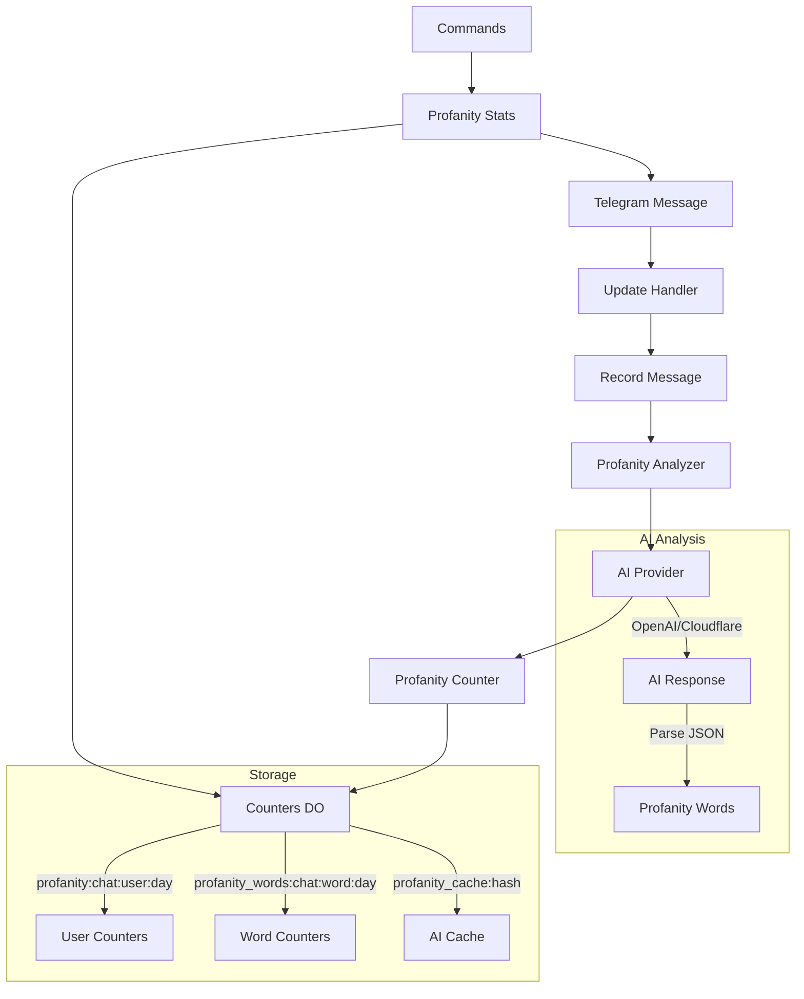

# Design Document

## Overview

Система отслеживания матерной лексики интегрируется в существующий Telegram бот для анализа сообщений с помощью AI провайдеров. Система использует существующую инфраструктуру счетчиков и добавляет новые команды для отображения статистики использования обсценной лексики.

Основные принципы дизайна:
- Использование AI для точной детекции мата вместо статических словарей
- Интеграция с существующей архитектурой провайдеров и счетчиков
- Минимальное влияние на производительность обработки сообщений
- Кэширование результатов AI для оптимизации

## Architecture

### High-Level Architecture



### Component Integration

Система интегрируется в существующую архитектуру следующим образом:

1. **Message Processing**: Добавляется в `recordMessage()` вызов анализатора мата
2. **Command Handling**: Новые команды добавляются в `handleUpdate()`
3. **AI Providers**: Используется существующая система провайдеров
4. **Counters**: Расширяется существующая система счетчиков
5. **Statistics**: Добавляются новые функции статистики в `stats.ts`

## Components and Interfaces

### 1. ProfanityAnalyzer

Основной компонент для анализа текста на наличие мата.

```typescript
interface ProfanityAnalyzer {
  analyzeMessage(text: string, env: Env): Promise<ProfanityResult>;
}

interface ProfanityResult {
  words: ProfanityWord[];
  totalCount: number;
}

interface ProfanityWord {
  original: string;    // Найденное слово в тексте
  baseForm: string;    // Базовая форма для группировки
  positions: number[]; // Позиции в тексте
}
```

**Responsibilities:**
- Отправка текста на анализ в AI провайдер
- Парсинг ответа AI и извлечение матерных слов
- Кэширование результатов для повторных запросов
- Обработка ошибок AI провайдера

### 2. ProfanityCounter

Компонент для учета статистики использования мата.

```typescript
interface ProfanityCounter {
  incrementUserCount(chatId: number, userId: number, count: number, day: string): Promise<void>;
  incrementWordCount(chatId: number, word: string, count: number, day: string): Promise<void>;
}
```

**Responsibilities:**
- Увеличение счетчиков пользователей
- Увеличение счетчиков слов
- Интеграция с существующей системой Counters DO

### 3. ProfanityStats

Компонент для генерации статистики и отчетов.

```typescript
interface ProfanityStats {
  getTopUsers(chatId: number, limit: number, period: string): Promise<UserStat[]>;
  getTopWords(chatId: number, limit: number, period: string): Promise<WordStat[]>;
  getUserStats(chatId: number, userId: number, period: string): Promise<UserProfanityStat>;
  generateChart(chatId: number, period: 'week' | 'month'): Promise<void>;
}

interface UserStat {
  userId: number;
  username: string;
  count: number;
}

interface WordStat {
  word: string;
  baseForm: string;
  count: number;
  censored: string; // Цензурированная версия для отображения
}

interface UserProfanityStat {
  today: number;
  week: number;
  month: number;
}
```

### 4. AI Integration

Расширение существующей системы провайдеров для анализа мата.

```typescript
interface ProfanityAIProvider {
  analyzeProfanity(text: string): Promise<ProfanityAnalysisResult>;
}

interface ProfanityAnalysisResult {
  hasProfanity: boolean;
  words: Array<{
    word: string;
    baseForm: string;
    confidence: number;
  }>;
}
```

## Data Models

### Storage Schema

Система использует следующие ключи в KV storage:

#### User Profanity Counters
```
Key: profanity:${chatId}:${userId}:${day}
Value: number (количество матерных слов)
TTL: 32 days
```

#### Word Profanity Counters
```
Key: profanity_words:${chatId}:${baseForm}:${day}
Value: number (количество использований слова)
TTL: 32 days
```

#### AI Response Cache
```
Key: profanity_cache:${textHash}
Value: JSON<ProfanityResult>
TTL: 24 hours
```

### Database Schema

Для долгосрочного хранения можно добавить таблицу:

```sql
CREATE TABLE IF NOT EXISTS profanity_stats (
  chat_id INTEGER NOT NULL,
  user_id INTEGER NOT NULL,
  day TEXT NOT NULL,
  word_count INTEGER NOT NULL DEFAULT 0,
  PRIMARY KEY (chat_id, user_id, day)
);

CREATE TABLE IF NOT EXISTS profanity_words (
  chat_id INTEGER NOT NULL,
  base_form TEXT NOT NULL,
  day TEXT NOT NULL,
  count INTEGER NOT NULL DEFAULT 0,
  PRIMARY KEY (chat_id, base_form, day)
);
```

## Error Handling

### AI Provider Errors

1. **Network Errors**: Логирование и пропуск анализа
2. **Rate Limiting**: Экспоненциальный backoff и кэширование
3. **Invalid Response**: Логирование и fallback к пустому результату
4. **Timeout**: Установка таймаута 5 секунд для AI запросов

### Data Consistency

1. **Counter Failures**: Retry механизм для критических операций
2. **Cache Misses**: Graceful degradation без кэша
3. **Storage Errors**: Логирование и продолжение работы

### Performance Safeguards

1. **Text Length Limit**: Максимум 1000 символов для анализа
2. **Rate Limiting**: Максимум 1 запрос к AI на сообщение
3. **Batch Processing**: Группировка обновлений счетчиков
4. **Circuit Breaker**: Отключение AI при частых ошибках

## Testing Strategy

### Unit Tests

1. **ProfanityAnalyzer Tests**
   - Тестирование парсинга AI ответов
   - Тестирование кэширования
   - Тестирование обработки ошибок

2. **ProfanityCounter Tests**
   - Тестирование инкремента счетчиков
   - Тестирование интеграции с Counters DO

3. **ProfanityStats Tests**
   - Тестирование генерации топов
   - Тестирование форматирования результатов
   - Тестирование цензурирования слов

### Integration Tests

1. **AI Provider Integration**
   - Тестирование с реальными AI провайдерами
   - Тестирование различных типов текста
   - Тестирование обработки ошибок

2. **End-to-End Tests**
   - Тестирование полного цикла: сообщение → анализ → статистика
   - Тестирование команд через Telegram API
   - Тестирование производительности

### Mock Strategy

1. **AI Provider Mocks**: Предопределенные ответы для тестирования
2. **KV Storage Mocks**: In-memory storage для unit тестов
3. **Telegram API Mocks**: Симуляция отправки сообщений

## Performance Considerations

### AI Request Optimization

1. **Caching Strategy**: 
   - Кэширование по хэшу текста
   - TTL 24 часа для баланса актуальности и производительности
   - LRU eviction при превышении лимитов

2. **Request Batching**:
   - Группировка коротких сообщений в один запрос
   - Максимум 5 сообщений в батче
   - Разделение результатов по исходным сообщениям

3. **Async Processing**:
   - Анализ мата в фоновом режиме
   - Не блокирует основную обработку сообщений
   - Использование `ctx.waitUntil()` для фоновых задач

### Storage Optimization

1. **Counter Aggregation**:
   - Батчинг обновлений счетчиков
   - Периодическая агрегация данных
   - Cleanup старых данных

2. **Memory Usage**:
   - Ограничение размера кэша
   - Streaming обработка больших результатов
   - Lazy loading статистики

## Security Considerations

### Data Privacy

1. **Text Processing**: Минимизация логирования исходного текста
2. **AI Requests**: Не сохранение полного текста в логах
3. **User Data**: Анонимизация в статистике при необходимости

### Content Filtering

1. **Output Censoring**: Автоматическое цензурирование матерных слов в выводе
2. **Admin Controls**: Возможность отключения функции для чата
3. **Rate Limiting**: Защита от спама команд статистики

### AI Security

1. **Prompt Injection**: Защита от попыток изменить поведение AI
2. **Response Validation**: Проверка структуры ответа AI
3. **Fallback Mechanisms**: Безопасные значения по умолчанию