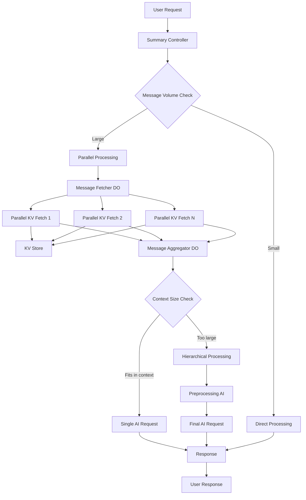
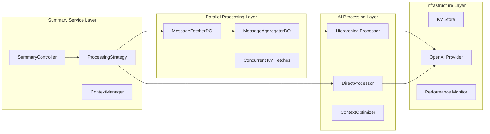
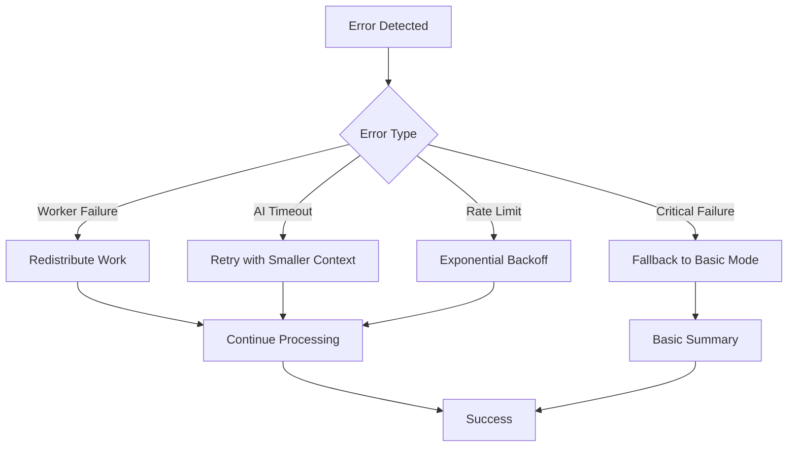

# Design Document

## Overview

Данный документ описывает архитектуру оптимизированной системы суммаризации сообщений, которая решает проблемы производительности и качества текущей реализации. Система использует параллельную обработку через Durable Objects и интеллектуальное управление контекстом OpenAI для достижения максимальной эффективности.

**Важно**: В контексте Cloudflare Workers "параллельные воркеры" означают параллельные Promise.all() операции внутри одного DO, а не отдельные Worker процессы. Это позволяет эффективно использовать конкурентность JavaScript для одновременных запросов к KV хранилищу.

## Architecture

### High-Level Architecture



### Component Architecture



## Components and Interfaces

### 1. SummaryController

Главный контроллер, который определяет стратегию обработки и координирует весь процесс.

```typescript
interface SummaryController {
  summarizeChat(chatId: number, days: number): Promise<string>;
  summarizeChatMessages(chatId: number, count: number): Promise<string>;
}

interface ProcessingStrategy {
  shouldUseParallelProcessing(estimatedMessageCount: number): boolean;
  shouldUseHierarchicalProcessing(tokenCount: number): boolean;
  getOptimalWorkerCount(messageCount: number): number;
}
```

### 2. MessageFetcherDO (Durable Object)

Координирует параллельную загрузку сообщений из KV хранилища. В Cloudflare Workers параллельность достигается через Promise.all() с множественными fetch() запросами к KV, а не через отдельные воркеры.

```typescript
interface MessageFetcherDO {
  // Инициализирует параллельную загрузку с использованием Promise.all()
  initializeParallelFetch(request: ParallelFetchRequest): Promise<string>; // returns sessionId
  
  // Получает статус загрузки
  getFetchStatus(sessionId: string): Promise<FetchStatus>;
  
  // Получает результаты загрузки
  getResults(sessionId: string): Promise<StoredMessage[]>;
  
  // Внутренний метод для параллельной обработки курсоров
  private processMultipleCursors(cursors: string[], batchSize: number): Promise<StoredMessage[]>;
}

interface ParallelFetchRequest {
  chatId: number;
  start: number;
  end: number;
  concurrentFetches: number; // количество параллельных fetch операций
  batchSize: number;
}

interface FetchStatus {
  sessionId: string;
  status: 'running' | 'completed' | 'failed';
  fetchesCompleted: number;
  totalFetches: number;
  messagesCollected: number;
  errors: string[];
}
```

### 3. MessageAggregatorDO (Durable Object)

Агрегирует результаты от параллельных воркеров и подготавливает данные для AI.

```typescript
interface MessageAggregatorDO {
  // Агрегирует сообщения от воркеров
  aggregateMessages(sessionId: string, messages: StoredMessage[]): Promise<void>;
  
  // Получает агрегированные и отсортированные сообщения
  getAggregatedMessages(sessionId: string): Promise<StoredMessage[]>;
  
  // Очищает данные сессии
  cleanupSession(sessionId: string): Promise<void>;
}
```

### 4. HierarchicalProcessor

Обрабатывает большие объемы сообщений через иерархическую суммаризацию.

```typescript
interface HierarchicalProcessor {
  process(messages: StoredMessage[], env: Env): Promise<string>;
}

interface ProcessingPhase {
  phase: 'preprocessing' | 'final';
  chunkSize: number;
  prompt: string;
  maxTokens: number;
}
```

### 5. ContextOptimizer

Оптимизирует использование контекста OpenAI.

```typescript
interface ContextOptimizer {
  // Оценивает количество токенов
  estimateTokens(messages: StoredMessage[]): number;
  
  // Оптимизирует сообщения для контекста
  optimizeForContext(messages: StoredMessage[], maxTokens: number): StoredMessage[];
  
  // Создает оптимальные чанки для обработки
  createOptimalChunks(messages: StoredMessage[], maxTokens: number): StoredMessage[][];
}
```

## Data Models

### Configuration Model

```typescript
interface SummaryOptimizationConfig {
  // Параллельная обработка
  parallelProcessing: {
    enabled: boolean;
    minMessagesThreshold: number;
    maxWorkers: number;
    workerBatchSize: number;
    workerTimeout: number;
  };
  
  // Управление контекстом
  contextManagement: {
    maxTokensPerRequest: number;
    preprocessingMaxTokens: number;
    finalMaxTokens: number;
    tokenEstimationFactor: number;
  };
  
  // Иерархическая обработка
  hierarchicalProcessing: {
    enabled: boolean;
    chunkSizeThreshold: number;
    preprocessingPrompt: string;
    maxPreprocessingChunks: number;
  };
  
  // Мониторинг
  monitoring: {
    enableDetailedMetrics: boolean;
    logPerformanceInsights: boolean;
    trackTokenUsage: boolean;
  };
}
```

### Session Model

```typescript
interface ProcessingSession {
  sessionId: string;
  chatId: number;
  startTime: number;
  endTime?: number;
  strategy: 'direct' | 'parallel' | 'hierarchical';
  status: 'initializing' | 'fetching' | 'processing' | 'completed' | 'failed';
  
  // Метрики
  metrics: {
    totalMessages: number;
    fetchDuration: number;
    processingDuration: number;
    tokensUsed: number;
    aiRequestsCount: number;
  };
  
  // Ошибки
  errors: ProcessingError[];
}

interface ProcessingError {
  stage: 'fetch' | 'aggregate' | 'ai_preprocessing' | 'ai_final';
  error: string;
  timestamp: number;
  recoverable: boolean;
}
```

## Error Handling

### Error Recovery Strategy



### Error Handling Levels

1. **Worker Level**: Отдельные воркеры могут падать без влияния на общий процесс
2. **Session Level**: Сессия может переключиться на альтернативную стратегию
3. **System Level**: Система может откатиться к базовому режиму работы

## Testing Strategy

### Unit Testing

- **SummaryController**: Тестирование логики выбора стратегии
- **MessageFetcherDO**: Тестирование координации воркеров
- **HierarchicalProcessor**: Тестирование алгоритмов чанкинга
- **ContextOptimizer**: Тестирование оценки токенов

### Integration Testing

- **End-to-End Flow**: Полный цикл от запроса до ответа
- **Parallel Processing**: Тестирование координации между DO
- **AI Integration**: Тестирование различных стратегий с реальными AI провайдерами
- **Error Scenarios**: Тестирование восстановления после ошибок

### Performance Testing

- **Load Testing**: Тестирование с различными объемами сообщений
- **Concurrency Testing**: Тестирование параллельной обработки нескольких запросов
- **Resource Usage**: Мониторинг использования памяти и CPU в DO

### Test Data Strategy

```typescript
interface TestScenario {
  name: string;
  messageCount: number;
  expectedStrategy: 'direct' | 'parallel' | 'hierarchical';
  expectedWorkers?: number;
  expectedChunks?: number;
  maxDuration: number;
}

const testScenarios: TestScenario[] = [
  {
    name: 'Small chat',
    messageCount: 50,
    expectedStrategy: 'direct',
    maxDuration: 5000
  },
  {
    name: 'Medium chat',
    messageCount: 500,
    expectedStrategy: 'parallel',
    expectedWorkers: 3,
    maxDuration: 15000
  },
  {
    name: 'Large chat',
    messageCount: 2000,
    expectedStrategy: 'hierarchical',
    expectedWorkers: 5,
    expectedChunks: 4,
    maxDuration: 30000
  }
];
```

## Implementation Phases

### Phase 1: Core Infrastructure
- Создание базовых интерфейсов и моделей данных
- Реализация SummaryController с выбором стратегии
- Создание ContextOptimizer для оценки токенов

### Phase 2: Parallel Processing
- Реализация MessageFetcherDO
- Создание системы параллельных воркеров
- Реализация MessageAggregatorDO

### Phase 3: Hierarchical Processing
- Реализация HierarchicalProcessor
- Создание системы промптов для предобработки
- Интеграция с ContextOptimizer

### Phase 4: Monitoring & Optimization
- Добавление детального мониторинга
- Реализация адаптивных алгоритмов
- Оптимизация производительности

### Phase 5: Testing & Deployment
- Комплексное тестирование
- Постепенное развертывание с feature flags
- Мониторинг производительности в продакшене