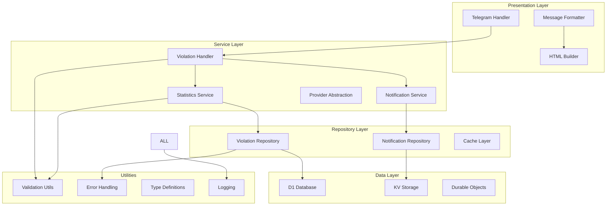

# Design Document

## Overview

This document outlines the comprehensive refactoring design for the TypeScript Telegram bot project that analyzes criminal code violations. The project is a sophisticated Cloudflare Workers application with Durable Objects, D1 database integration, and AI-powered analysis capabilities.

**Current Architecture Components:**
- **Telegram Bot Core**: Message handling, user interactions, command processing
- **Criminal Code Analysis**: AI-powered violation detection using multiple providers (Cloudflare AI, OpenAI)
- **Statistics System**: User stats, period stats, general stats with violation tracking
- **Message Processing**: HTML formatting, message aggregation, batch processing
- **Data Layer**: D1 database with repositories, KV storage, Durable Objects
- **Provider System**: Pluggable AI providers with factory pattern
- **Notification System**: User notification preferences and delivery

The refactoring will address code duplication, type safety issues, complex functions, unused code, inconsistent error handling, and testing gaps while maintaining the sophisticated functionality.

## Architecture

### Current Architecture Issues

**Code Quality Issues:**
1. **Code Duplication**: HTML formatting logic duplicated across MessageFormatter and HTMLBuilder
2. **Complex Functions**: MessageFormatter methods exceed 100 lines with multiple responsibilities
3. **Unused Imports**: `htmlBuilder`, `ViolationCount`, `UserViolationCount` imports not used
4. **Type Safety Issues**: 25+ TypeScript errors in ViolationRepository related to database result typing

**Architecture Issues:**
5. **Inconsistent Error Handling**: Mixed patterns between `unknown` error types and proper error classes
6. **Tight Coupling**: ViolationHandler directly instantiates dependencies instead of using dependency injection
7. **Validation Scattered**: Validation logic spread across multiple files without centralization
8. **Testing Gaps**: Missing integration tests for Durable Objects and database operations

**Performance Issues:**
9. **Database Query Inefficiency**: Repeated similar queries without proper abstraction
10. **Memory Leaks**: Potential issues with large dataset processing in batch operations

### Target Architecture



## Components and Interfaces

### 1. Core Utilities Refactoring

**HTML Utilities Consolidation**
- Merge HTMLBuilder and html-utils functionality into a single, cohesive module
- Remove duplication between `getSeverityEmoji` implementations
- Create template-based message building system
- Implement consistent escaping and sanitization

**Error Handling Standardization**
- Create `AppError` class hierarchy for different error types
- Implement `Result<T>` pattern for consistent error handling
- Replace all `unknown` error types with proper typing
- Add error context and correlation IDs for debugging

**Validation Utilities Enhancement**
- Consolidate ValidationUtils, DataSanitizer into single validation module
- Create schema-based validation for all data models
- Implement runtime type checking with proper error messages
- Add data recovery and sanitization for corrupted inputs

### 2. MessageFormatter Simplification

**Method Decomposition**
- Split `formatUserStats` (150+ lines) into focused methods
- Extract common patterns like violation list formatting
- Create message section builders (header, body, footer)
- Implement builder pattern for complex message construction

**Template System**
- Create message templates for different violation types
- Implement template inheritance for common message structures
- Add internationalization support for message templates
- Create template validation and testing framework

### 3. Repository Layer Improvements

**Type Safety Enhancement**
- Fix all 25+ TypeScript errors in ViolationRepository
- Create proper typing for D1 database results
- Implement type-safe query builders
- Add runtime validation for database operations

**Query Optimization**
- Extract common SQL patterns into query builder classes
- Implement connection pooling and transaction management
- Add query performance monitoring and optimization
- Create database migration and schema validation tools

**Cache Layer Implementation**
- Add Redis-like caching layer using KV storage
- Implement cache invalidation strategies
- Add cache warming for frequently accessed data
- Create cache performance metrics and monitoring

### 4. Service Layer Enhancement

**Dependency Injection**
- Implement proper DI container for service management
- Remove tight coupling in ViolationHandler constructor
- Create service interfaces and implementations
- Add service lifecycle management

**Provider System Improvement**
- Enhance ProviderFactory with better error handling
- Add provider health checks and failover mechanisms
- Implement provider-specific configuration validation
- Create provider performance monitoring

### 5. Testing Infrastructure

**Test Utilities**
- Create comprehensive test fixtures for all data models
- Implement database seeding and cleanup utilities
- Add mock implementations for all external dependencies
- Create test data generators with realistic data

**Coverage Enhancement**
- Achieve 95%+ code coverage for all modules
- Add integration tests for Durable Objects
- Create end-to-end tests for complete user workflows
- Implement performance and load testing

## Data Models

### Enhanced Type Definitions

```typescript
// Improved error handling types
export interface AppError {
  code: string;
  message: string;
  details?: unknown;
  timestamp: Date;
  correlationId?: string;
  context?: Record<string, unknown>;
}

// Standardized result types
export interface Result<T> {
  success: boolean;
  data?: T;
  error?: AppError;
  metadata?: {
    executionTime?: number;
    cacheHit?: boolean;
    source?: string;
  };
}

// Enhanced validation types
export interface ValidationResult {
  isValid: boolean;
  errors: ValidationError[];
  warnings: ValidationWarning[];
  sanitizedData?: unknown;
}

// Database result types
export interface DatabaseResult<T> {
  results: T[];
  success: boolean;
  meta: {
    duration: number;
    rows_read: number;
    rows_written: number;
  };
}
```

### Refactored Models

**Statistics Models Consolidation**
- Remove duplicate `Violation` interface definitions (exists in both message-formatter.ts and statistics.ts)
- Consolidate `ViolationCount` and `UserViolationCount` into single hierarchy
- Add proper inheritance for stats models (BaseStats → UserStats, PeriodStats, GeneralStats)
- Implement proper typing for optional fields vs required fields

**Provider Models Enhancement**
- Create unified provider response types
- Add provider-specific error types
- Implement provider capability interfaces
- Add provider configuration validation types

**Database Models Improvement**
- Create proper D1 result typing to fix repository errors
- Add database entity base classes
- Implement proper foreign key relationships
- Add database constraint validation types

## Error Handling

### Unified Error Handling Strategy

1. **Error Types**: Define specific error classes for different failure scenarios
2. **Error Boundaries**: Implement consistent error catching and handling
3. **Logging**: Standardize error logging with proper context
4. **Recovery**: Implement graceful error recovery where possible

### Implementation Pattern

```typescript
export class ErrorHandler {
  static handle<T>(operation: () => T, context: string): Result<T> {
    try {
      const result = operation();
      return { success: true, data: result };
    } catch (error) {
      const appError = this.createAppError(error, context);
      this.logError(appError);
      return { success: false, error: appError };
    }
  }
}
```

## Testing Strategy

### Unit Testing

- **Coverage Target**: 95% code coverage for all modules
- **Test Structure**: Arrange-Act-Assert pattern
- **Mock Strategy**: Comprehensive mocking of external dependencies
- **Edge Cases**: Extensive testing of boundary conditions and error scenarios

### Integration Testing

- **Database Integration**: Test repository layer with real database operations
- **Service Integration**: Test service layer interactions
- **API Integration**: Test external API interactions with proper mocking

### End-to-End Testing

- **User Workflows**: Test complete user interaction scenarios
- **Error Scenarios**: Test error handling in realistic conditions
- **Performance Testing**: Validate performance under load

### Test Organization

```
tests/
├── unit/
│   ├── models/
│   ├── services/
│   ├── repositories/
│   └── utils/
├── integration/
│   ├── database/
│   ├── services/
│   └── workflows/
├── e2e/
│   ├── user-scenarios/
│   └── error-scenarios/
└── fixtures/
    ├── data/
    └── mocks/
```

## Refactoring Phases

### Phase 1: Foundation
- Establish unified error handling
- Create shared utility functions
- Fix TypeScript errors and type safety issues
- Remove unused code and imports

### Phase 2: Core Refactoring
- Refactor MessageFormatter into smaller, focused modules
- Consolidate HTML formatting logic
- Improve repository layer type safety
- Enhance validation utilities

### Phase 3: Testing Enhancement
- Implement comprehensive unit test coverage
- Add integration tests for critical workflows
- Create end-to-end test scenarios
- Establish performance benchmarks

### Phase 4: Documentation and Optimization
- Add comprehensive JSDoc documentation
- Optimize performance bottlenecks
- Implement code quality metrics
- Create developer guidelines

## Quality Metrics

### Code Quality Targets
- **Cyclomatic Complexity**: Maximum 10 per function
- **Function Length**: Maximum 50 lines per function
- **File Length**: Maximum 300 lines per file
- **Test Coverage**: Minimum 95% line coverage

### Performance Targets
- **Response Time**: Maximum 100ms for formatting operations
- **Memory Usage**: Efficient memory management with proper cleanup
- **Database Queries**: Optimized queries with proper indexing

## Migration Strategy

### Backward Compatibility
- Maintain existing API interfaces during refactoring
- Implement feature flags for gradual rollout
- Create migration scripts for data structure changes

### Rollout Plan
1. **Development Environment**: Complete refactoring and testing
2. **Staging Environment**: Integration testing and performance validation
3. **Production Environment**: Gradual rollout with monitoring
4. **Cleanup**: Remove deprecated code after successful migration