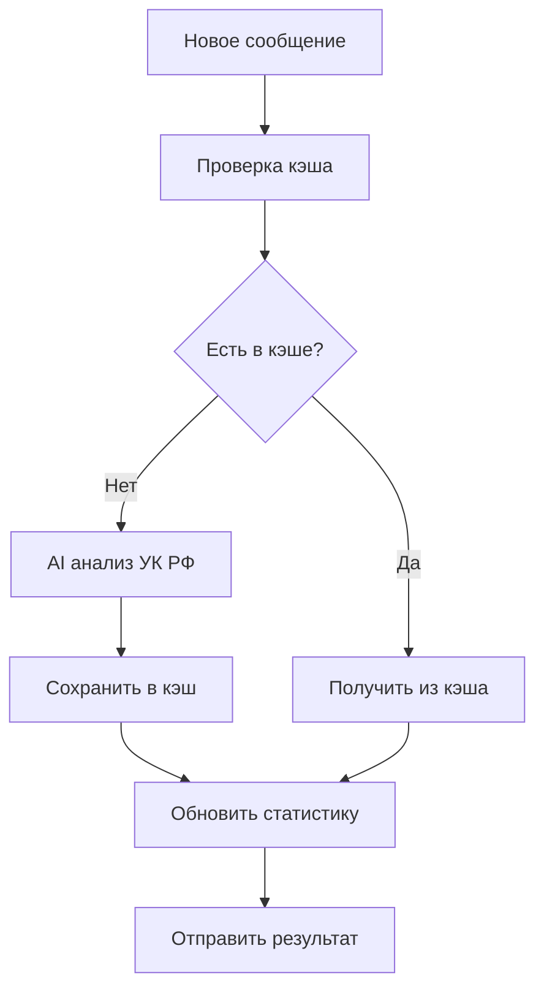
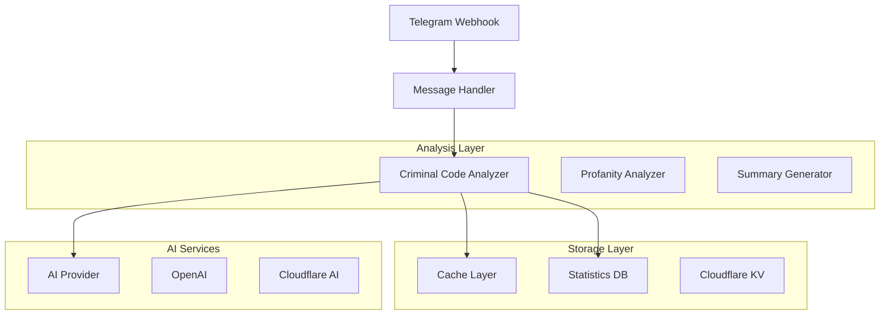
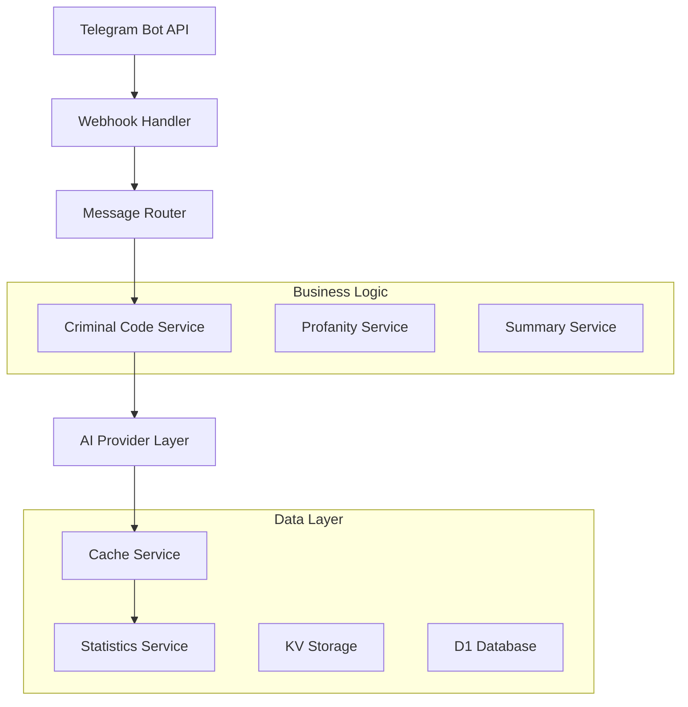
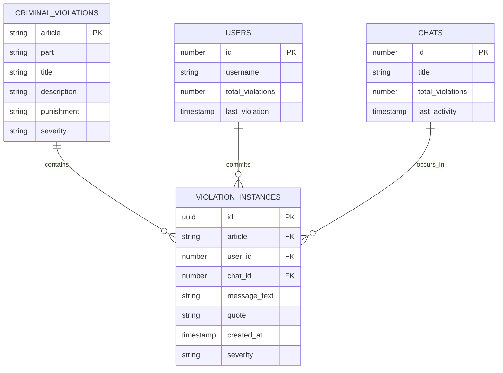

# Техническая документация: Анализ нарушений УК РФ

## 1. Обзор проекта

Добавление функционала анализа нарушений статей Уголовного кодекса РФ в существующий Telegram бот для статистики чатов. Система должна анализировать сообщения участников на предмет возможных нарушений УК РФ, определять конкретные статьи, пункты и возможные наказания.

## 2. Основные функции

### 2.1 Роли пользователей

| Роль               | Метод регистрации                    | Основные права                               |
| ------------------ | ------------------------------------ | -------------------------------------------- |
| Участник чата      | Автоматически при отправке сообщений | Может получать анализ своих нарушений        |
| Администратор чата | Права администратора Telegram        | Может запрашивать общую статистику нарушений |

### 2.2 Модули функций

Основные страницы и функции системы:

1. **Анализ сообщений**: детекция нарушений УК РФ, определение статей и пунктов
2. **Статистика нарушений**: подсчет нарушений по пользователям и статьям
3. **Отчеты**: генерация отчетов о нарушениях в чате

### 2.3 Детали модулей

| Модуль           | Название функции       | Описание функции                                                                                                       |
| ---------------- | ---------------------- | ---------------------------------------------------------------------------------------------------------------------- |
| Анализ сообщений | Детекция УК РФ         | Анализирует текст сообщения на нарушения статей УК РФ, определяет конкретные статьи, пункты, цитирует нарушающие фразы |
| Анализ сообщений | Определение наказания  | Указывает возможные виды и сроки наказания согласно УК РФ                                                              |
| Статистика       | Подсчет нарушений      | Ведет статистику нарушений по пользователям, статьям УК РФ и временным периодам                                        |
| Отчеты           | Генерация сводок       | Создает отчеты о нарушениях для администраторов чата                                                                   |
| Кэширование      | Сохранение результатов | Кэширует результаты анализа для экономии токенов AI                                                                    |

## 3. Основные процессы

**Процесс анализа сообщения:**

1. Получение нового сообщения через webhook
2. Проверка кэша на наличие анализа для данного текста
3. Если кэш пуст - отправка запроса к AI провайдеру для анализа УК РФ
4. Сохранение результатов в кэш и базу данных
5. Обновление статистики нарушений пользователя

**Процесс генерации отчета:**

1. Запрос статистики нарушений за период
2. Агрегация данных по пользователям и статьям
3. Формирование отчета с примерами нарушений
4. Отправка отчета администратору



## 4. Дизайн интерфейса

### 4.1 Стиль дизайна

* Основные цвета: #FF4444 (красный для нарушений), #FFA500 (оранжевый для предупреждений), #28A745 (зеленый для чистых сообщений)

* Стиль кнопок: округлые с тенью

* Шрифт: системный шрифт, размеры 12-16px

* Стиль макета: карточный дизайн с четкой иерархией

* Иконки: эмодзи для обозначения типов нарушений (⚖️, 🚫, ⚠️)

### 4.2 Обзор дизайна страниц

| Модуль           | Название функции  | UI элементы                                                                                                    |
| ---------------- | ----------------- | -------------------------------------------------------------------------------------------------------------- |
| Анализ сообщений | Результат анализа | Карточка с цветовой индикацией серьезности, список нарушенных статей, цитаты из сообщения, возможные наказания |
| Статистика       | Сводка нарушений  | Таблица с пользователями, количеством нарушений, топ статей УК РФ, графики динамики                            |
| Отчеты           | Детальный отчет   | Структурированный текст с заголовками, списками нарушений, примерами сообщений                                 |

### 4.3 Адаптивность

Система работает в Telegram боте, поэтому адаптивность обеспечивается форматированием текстовых сообщений с использованием Markdown разметки.

## 5. Техническая архитектура

### 5.1 Диаграмма архитектуры



### 5.2 Описание технологий

* Frontend: Telegram Bot API (текстовые сообщения с Markdown)

* Backend: Cloudflare Workers + TypeScript

* База данных: Cloudflare KV для кэширования, D1 для статистики

* AI: OpenAI GPT / Cloudflare Workers AI

### 5.3 Определения маршрутов

| Маршрут  | Назначение                            |
| -------- | ------------------------------------- |
| /webhook | Обработка входящих сообщений Telegram |
| /stats   | Получение статистики нарушений        |
| /report  | Генерация отчета о нарушениях         |

### 5.4 Определения API

#### 5.4.1 Основное API

Анализ нарушений УК РФ

```
POST /api/analyze-criminal-code
```

Запрос:

| Параметр | Тип    | Обязательный | Описание                    |
| -------- | ------ | ------------ | --------------------------- |
| text     | string | true         | Текст сообщения для анализа |
| userId   | number | true         | ID пользователя             |
| chatId   | number | true         | ID чата                     |

Ответ:

| Параметр      | Тип     | Описание                    |
| ------------- | ------- | --------------------------- |
| hasViolations | boolean | Наличие нарушений УК РФ     |
| violations    | array   | Массив нарушений            |
| totalSeverity | string  | Общая серьезность нарушений |

Пример ответа:

```json
{
  "hasViolations": true,
  "violations": [
    {
      "article": "282",
      "part": "1",
      "title": "Возбуждение ненависти либо вражды",
      "quote": "конкретная фраза из сообщения",
      "punishment": "штраф до 300 тысяч рублей или лишение свободы до 4 лет",
      "severity": "high"
    }
  ],
  "totalSeverity": "high"
}
```

### 5.5 Диаграмма серверной архитектуры



### 5.6 Модель данных

#### 5.6.1 Определение модели данных



#### 5.6.2 DDL (Data Definition Language)

Таблица нарушений УК РФ (criminal\_violations)

```sql
-- create table
CREATE TABLE criminal_violations (
    id UUID PRIMARY KEY DEFAULT gen_random_uuid(),
    user_id INTEGER NOT NULL,
    chat_id INTEGER NOT NULL,
    username VARCHAR(255) NOT NULL,
    article VARCHAR(10) NOT NULL,
    part VARCHAR(10),
    title VARCHAR(500) NOT NULL,
    quote TEXT NOT NULL,
    message_text TEXT NOT NULL,
    punishment TEXT NOT NULL,
    severity VARCHAR(20) DEFAULT 'medium' CHECK (severity IN ('low', 'medium', 'high', 'critical')),
    created_at TIMESTAMP WITH TIME ZONE DEFAULT NOW(),
    updated_at TIMESTAMP WITH TIME ZONE DEFAULT NOW()
);

-- create indexes
CREATE INDEX idx_criminal_violations_user_id ON criminal_violations(user_id);
CREATE INDEX idx_criminal_violations_chat_id ON criminal_violations(chat_id);
CREATE INDEX idx_criminal_violations_article ON criminal_violations(article);
CREATE INDEX idx_criminal_violations_created_at ON criminal_violations(created_at DESC);
CREATE INDEX idx_criminal_violations_severity ON criminal_violations(severity);

-- Таблица статистики пользователей
CREATE TABLE user_violation_stats (
    user_id INTEGER PRIMARY KEY,
    username VARCHAR(255) NOT NULL,
    total_violations INTEGER DEFAULT 0,
    high_severity_count INTEGER DEFAULT 0,
    last_violation_at TIMESTAMP WITH TIME ZONE,
    created_at TIMESTAMP WITH TIME ZONE DEFAULT NOW(),
    updated_at TIMESTAMP WITH TIME ZONE DEFAULT NOW()
);

-- init data
INSERT INTO criminal_violations (user_id, chat_id, username, article, part, title, quote, message_text, punishment, severity)
VALUES (12345, -67890, 'test_user', '282', '1', 'Возбуждение ненависти либо вражды', 'тестовая фраза', 'полный текст сообщения', 'штраф до 300 тысяч рублей', 'high');
```

## 6. Интеграция с существующей системой

### 6.1 Модификация AI Provider интерфейса

Добавить новый метод в интерфейс `AIProvider`:

```typescript
interface CriminalCodeAnalysisResult {
  hasViolations: boolean;
  violations: Array<{
    article: string;
    part?: string;
    title: string;
    quote: string;
    punishment: string;
    severity: 'low' | 'medium' | 'high' | 'critical';
    confidence: number;
  }>;
  totalSeverity: 'low' | 'medium' | 'high' | 'critical';
}

interface AIProvider {
  // ... существующие методы
  analyzeCriminalCode(text: string, env?: any): Promise<CriminalCodeAnalysisResult>;
}
```

### 6.2 Промпты для анализа УК РФ

**Системный промпт:**

```
Ты эксперт по российскому уголовному праву. Анализируй текст на нарушения статей УК РФ.

ПРАВИЛА:
1. Анализируй только явные призывы к противоправным действиям
2. Учитывай контекст и намерения
3. Указывай конкретные статьи, части и пункты УК РФ
4. Цитируй нарушающие фразы точно
5. Определяй серьезность: low, medium, high, critical

ФОРМАТ JSON:
{
  "hasViolations": boolean,
  "violations": [{
    "article": "номер_статьи",
    "part": "часть",
    "title": "название_статьи",
    "quote": "цитата_из_текста",
    "punishment": "возможное_наказание",
    "severity": "уровень_серьезности",
    "confidence": число_от_0_до_1
  }],
  "totalSeverity": "общий_уровень"
}
```

### 6.3 Кэширование результатов

Использовать существующую систему кэширования с ключами вида:
`criminal_code_cache:{hash_of_text}`

TTL: 24 часа (как у profanity анализа)

### 6.4 Интеграция с отчетами

Добавить секцию нарушений УК РФ в существующие summary отчеты:

```
📊 СТАТИСТИКА ЧАТА
...
⚖️ НАРУШЕНИЯ УК РФ:
- Всего нарушений: X
- Участников с нарушениями: Y
- Самые частые статьи: 282 (Z раз), 319 (W раз)
```

