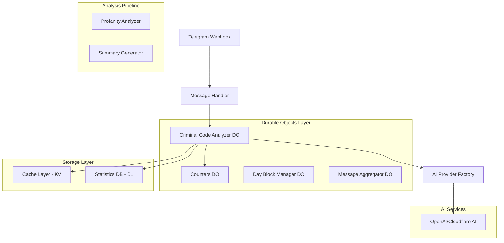
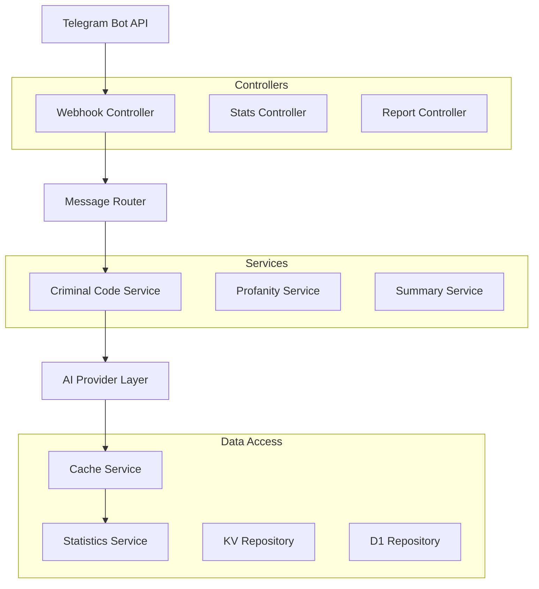
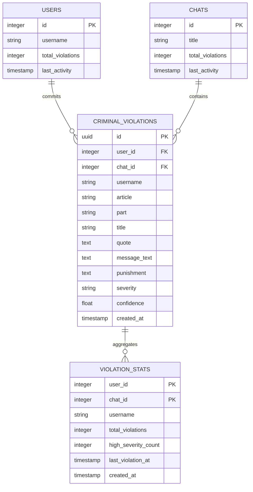

# Техническая архитектура: Анализ нарушений УК РФ

## 1. Архитектурная схема



## 2. Описание технологий

* Frontend: Telegram Bot API (текстовые сообщения)

* Backend: Cloudflare Workers + TypeScript + Durable Objects

* База данных: Cloudflare D1 (SQLite)

* Кэш: Cloudflare KV

* AI: OpenAI GPT-4 / Cloudflare Workers AI

* Race Condition Protection: Durable Objects с blockConcurrencyWhile()

## 3. Определения маршрутов

| Маршрут          | Назначение                                    |
| ---------------- | --------------------------------------------- |
| /webhook         | Обработка Telegram сообщений с анализом УК РФ |
| /criminal-stats  | Получение статистики нарушений                |
| /criminal-report | Генерация отчета о нарушениях                 |

## 4. API определения

### 4.1 Основное API

Анализ нарушений УК РФ

```
POST /api/analyze-criminal-code
```

Запрос:

| Параметр | Тип    | Обязательный | Описание          |
| -------- | ------ | ------------ | ----------------- |
| text     | string | true         | Текст для анализа |
| userId   | number | true         | ID пользователя   |
| chatId   | number | true         | ID чата           |

Ответ:

| Параметр      | Тип     | Описание          |
| ------------- | ------- | ----------------- |
| hasViolations | boolean | Есть ли нарушения |
| violations    | array   | Список нарушений  |
| totalSeverity | string  | Общая серьезность |

Пример:

```json
{
  "hasViolations": true,
  "violations": [
    {
      "article": "282",
      "part": "1",
      "title": "Возбуждение ненависти либо вражды",
      "quote": "конкретная фраза",
      "punishment": "штраф до 300 тыс. руб.",
      "severity": "high",
      "confidence": 0.85
    }
  ],
  "totalSeverity": "high"
}
```

Статистика нарушений

```
GET /api/criminal-stats
```

Запрос:

| Параметр | Тип    | Обязательный | Описание                |
| -------- | ------ | ------------ | ----------------------- |
| chatId   | number | true         | ID чата                 |
| period   | string | false        | Период (day/week/month) |
| userId   | number | false        | Конкретный пользователь |

Ответ:

| Параметр        | Тип    | Описание                    |
| --------------- | ------ | --------------------------- |
| totalViolations | number | Общее количество нарушений  |
| userStats       | array  | Статистика по пользователям |
| articleStats    | array  | Статистика по статьям УК    |

## 5. Серверная архитектура



## 6. Модель данных

### 6.1 Диаграмма сущностей



### 6.2 DDL (Data Definition Language)

Таблица нарушений УК РФ

```sql
-- Основная таблица нарушений
CREATE TABLE criminal_violations (
    id TEXT PRIMARY KEY DEFAULT (lower(hex(randomblob(16)))),
    user_id INTEGER NOT NULL,
    chat_id INTEGER NOT NULL,
    username TEXT NOT NULL,
    article TEXT NOT NULL,
    part TEXT,
    title TEXT NOT NULL,
    quote TEXT NOT NULL,
    message_text TEXT NOT NULL,
    punishment TEXT NOT NULL,
    severity TEXT DEFAULT 'medium' CHECK (severity IN ('low', 'medium', 'high', 'critical')),
    confidence REAL DEFAULT 0.0,
    created_at DATETIME DEFAULT CURRENT_TIMESTAMP,
    updated_at DATETIME DEFAULT CURRENT_TIMESTAMP
);

-- Индексы для оптимизации запросов
CREATE INDEX idx_criminal_violations_user_id ON criminal_violations(user_id);
CREATE INDEX idx_criminal_violations_chat_id ON criminal_violations(chat_id);
CREATE INDEX idx_criminal_violations_article ON criminal_violations(article);
CREATE INDEX idx_criminal_violations_created_at ON criminal_violations(created_at DESC);
CREATE INDEX idx_criminal_violations_severity ON criminal_violations(severity);
CREATE INDEX idx_criminal_violations_composite ON criminal_violations(chat_id, created_at DESC);

-- Таблица агрегированной статистики
CREATE TABLE violation_stats (
    user_id INTEGER,
    chat_id INTEGER,
    username TEXT NOT NULL,
    total_violations INTEGER DEFAULT 0,
    high_severity_count INTEGER DEFAULT 0,
    critical_severity_count INTEGER DEFAULT 0,
    last_violation_at DATETIME,
    created_at DATETIME DEFAULT CURRENT_TIMESTAMP,
    updated_at DATETIME DEFAULT CURRENT_TIMESTAMP,
    PRIMARY KEY (user_id, chat_id)
);

-- Индексы для статистики
CREATE INDEX idx_violation_stats_chat_id ON violation_stats(chat_id);
CREATE INDEX idx_violation_stats_total ON violation_stats(total_violations DESC);
CREATE INDEX idx_violation_stats_last_violation ON violation_stats(last_violation_at DESC);

-- Таблица для кэширования результатов анализа
CREATE TABLE criminal_analysis_cache (
    text_hash TEXT PRIMARY KEY,
    analysis_result TEXT NOT NULL, -- JSON
    created_at DATETIME DEFAULT CURRENT_TIMESTAMP,
    expires_at DATETIME NOT NULL
);

-- Индекс для очистки устаревшего кэша
CREATE INDEX idx_criminal_cache_expires ON criminal_analysis_cache(expires_at);

-- Триггер для обновления статистики
CREATE TRIGGER update_violation_stats 
AFTER INSERT ON criminal_violations
BEGIN
    INSERT OR REPLACE INTO violation_stats (
        user_id, chat_id, username, total_violations, 
        high_severity_count, critical_severity_count, last_violation_at, updated_at
    )
    SELECT 
        NEW.user_id,
        NEW.chat_id,
        NEW.username,
        COALESCE((SELECT total_violations FROM violation_stats 
                 WHERE user_id = NEW.user_id AND chat_id = NEW.chat_id), 0) + 1,
        COALESCE((SELECT high_severity_count FROM violation_stats 
                 WHERE user_id = NEW.user_id AND chat_id = NEW.chat_id), 0) + 
                 CASE WHEN NEW.severity = 'high' THEN 1 ELSE 0 END,
        COALESCE((SELECT critical_severity_count FROM violation_stats 
                 WHERE user_id = NEW.user_id AND chat_id = NEW.chat_id), 0) + 
                 CASE WHEN NEW.severity = 'critical' THEN 1 ELSE 0 END,
        NEW.created_at,
        CURRENT_TIMESTAMP;
END;

-- Начальные данные для тестирования
INSERT INTO criminal_violations (
    user_id, chat_id, username, article, part, title, 
    quote, message_text, punishment, severity, confidence
) VALUES (
    123456, -987654, 'test_user', '282', '1', 
    'Возбуждение ненависти либо вражды', 
    'тестовая нарушающая фраза',
    'полный текст тестового сообщения',
    'штраф в размере до трехсот тысяч рублей или лишение свободы на срок до четырех лет',
    'high', 0.85
);
```

## 7. Компоненты системы

### 7.1 CriminalCodeAnalyzerDO (Durable Object)

```typescript
import type { DurableObjectState, DurableObjectStorage } from '@cloudflare/workers-types';
import { Env } from './env';
import { Logger } from './logger';

/**
 * Durable Object for Criminal Code analysis with race condition protection
 * Ensures atomic operations and prevents data corruption during concurrent analysis
 */
export class CriminalCodeAnalyzerDO {
  private env: Env;
  private storage: DurableObjectStorage;
  private state: DurableObjectState;
  
  // Constants
  private static readonly CACHE_TTL = 24 * 60 * 60; // 24 hours
  private static readonly MAX_TEXT_LENGTH = 2000;
  private static readonly ANALYSIS_TIMEOUT = 15000; // 15 seconds
  private static readonly BATCH_SIZE = 5;
  
  constructor(state: DurableObjectState, env: Env) {
    this.env = env;
    this.storage = state.storage;
    this.state = state;
  }
  
  async fetch(request: Request): Promise<Response> {
    try {
      const url = new URL(request.url);
      const method = request.method;
      
      if (method === 'POST' && url.pathname === '/analyze') {
        // Serialize concurrent analysis to prevent race conditions
        return await this.state.blockConcurrencyWhile(() => this.handleAnalyze(request));
      }
      
      if (method === 'POST' && url.pathname === '/batch-analyze') {
        return await this.state.blockConcurrencyWhile(() => this.handleBatchAnalyze(request));
      }
      
      if (method === 'GET' && url.pathname === '/stats') {
        return await this.handleGetStats(request);
      }
      
      if (method === 'POST' && url.pathname === '/health') {
        return new Response(JSON.stringify({ status: 'healthy' }), {
          headers: { 'Content-Type': 'application/json' }
        });
      }
      
      return new Response('Not Found', { status: 404 });
    } catch (error: any) {
      Logger.error('CriminalCodeAnalyzerDO: request failed', {
        error: error.message || String(error),
        stack: error.stack,
        url: request.url,
        method: request.method
      });
      return new Response(JSON.stringify({ error: error.message }), {
        status: 500,
        headers: { 'Content-Type': 'application/json' }
      });
    }
  }
  
  private async handleAnalyze(request: Request): Promise<Response> {
    const body = await request.json() as {
      text: string;
      userId: number;
      chatId: number;
      username: string;
      messageId?: number;
    };
    
    const { text, userId, chatId, username, messageId } = body;
    
    Logger.debug(this.env, 'CriminalCodeAnalyzerDO: analyzing message', {
      chat: chatId.toString(36),
      user: userId.toString(36),
      textLength: text.length,
      messageId
    });
    
    try {
      // Check cache first
      const cacheKey = this.generateCacheKey(text);
      const cached = await this.getCachedResult(cacheKey);
      if (cached) {
        Logger.debug(this.env, 'CriminalCodeAnalyzerDO: cache hit', {
          chat: chatId.toString(36),
          cacheKey: cacheKey.substring(0, 16)
        });
        return new Response(JSON.stringify({
          success: true,
          result: cached,
          fromCache: true
        }), { headers: { 'Content-Type': 'application/json' } });
      }
      
      // Perform AI analysis
      const aiProvider = ProviderFactory.createProvider(this.env);
      const result = await aiProvider.analyzeCriminalCode(text, this.env);
      
      // Cache result
      await this.cacheResult(cacheKey, result);
      
      // Store violation if found
      if (result.hasViolations) {
        await this.storeViolations(result, userId, chatId, username, text, messageId);
        await this.updateStatistics(userId, chatId, username, result);
      }
      
      Logger.debug(this.env, 'CriminalCodeAnalyzerDO: analysis completed', {
        chat: chatId.toString(36),
        hasViolations: result.hasViolations,
        violationsCount: result.violations.length,
        totalSeverity: result.totalSeverity
      });
      
      return new Response(JSON.stringify({
        success: true,
        result,
        fromCache: false
      }), { headers: { 'Content-Type': 'application/json' } });
      
    } catch (error: any) {
      Logger.error('CriminalCodeAnalyzerDO: analysis failed', {
        chat: chatId.toString(36),
        user: userId.toString(36),
        error: error.message || String(error),
        stack: error.stack
      });
      throw error;
    }
  }
  
  private async handleBatchAnalyze(request: Request): Promise<Response> {
    const body = await request.json() as {
      items: Array<{
        text: string;
        userId: number;
        chatId: number;
        username: string;
        messageId?: number;
      }>;
    };
    
    const { items } = body;
    
    if (!Array.isArray(items) || items.length === 0 || items.length > CriminalCodeAnalyzerDO.BATCH_SIZE) {
      return new Response('Invalid batch size', { status: 400 });
    }
    
    try {
      const results = [];
      
      for (const item of items) {
        const cacheKey = this.generateCacheKey(item.text);
        let result = await this.getCachedResult(cacheKey);
        
        if (!result) {
          const aiProvider = ProviderFactory.createProvider(this.env);
          result = await aiProvider.analyzeCriminalCode(item.text, this.env);
          await this.cacheResult(cacheKey, result);
          
          if (result.hasViolations) {
            await this.storeViolations(result, item.userId, item.chatId, item.username, item.text, item.messageId);
            await this.updateStatistics(item.userId, item.chatId, item.username, result);
          }
        }
        
        results.push({
          messageId: item.messageId,
          result,
          fromCache: !!result
        });
      }
      
      return new Response(JSON.stringify({
        success: true,
        results,
        processed: items.length
      }), { headers: { 'Content-Type': 'application/json' } });
      
    } catch (error: any) {
      Logger.error('CriminalCodeAnalyzerDO: batch analysis failed', {
        error: error.message || String(error),
        itemsCount: items.length
      });
      throw error;
    }
  }
  
  private generateCacheKey(text: string): string {
    // Use crypto.subtle for consistent hashing
    const encoder = new TextEncoder();
    const data = encoder.encode(text.trim().toLowerCase());
    return `criminal_analysis:${this.hashText(text)}`;
  }
  
  private hashText(text: string): string {
    // Simple hash for cache key
    let hash = 0;
    for (let i = 0; i < text.length; i++) {
      const char = text.charCodeAt(i);
      hash = ((hash << 5) - hash) + char;
      hash = hash & hash; // Convert to 32-bit integer
    }
    return Math.abs(hash).toString(36);
  }
  
  private async getCachedResult(cacheKey: string): Promise<CriminalCodeAnalysisResult | null> {
    try {
      const cached = await this.storage.get<{
        result: CriminalCodeAnalysisResult;
        expiresAt: number;
      }>(cacheKey);
      
      if (cached && cached.expiresAt > Date.now()) {
        return cached.result;
      }
      
      // Clean up expired cache
      if (cached) {
        await this.storage.delete(cacheKey);
      }
      
      return null;
    } catch (error) {
      Logger.error('CriminalCodeAnalyzerDO: cache read failed', {
        cacheKey: cacheKey.substring(0, 16),
        error: error.message || String(error)
      });
      return null;
    }
  }
  
  private async cacheResult(cacheKey: string, result: CriminalCodeAnalysisResult): Promise<void> {
    try {
      await this.storage.put(cacheKey, {
        result,
        expiresAt: Date.now() + (CriminalCodeAnalyzerDO.CACHE_TTL * 1000)
      });
    } catch (error) {
      Logger.error('CriminalCodeAnalyzerDO: cache write failed', {
        cacheKey: cacheKey.substring(0, 16),
        error: error.message || String(error)
      });
    }
  }
  
  private async storeViolations(
    result: CriminalCodeAnalysisResult,
    userId: number,
    chatId: number,
    username: string,
    messageText: string,
    messageId?: number
  ): Promise<void> {
    if (!this.env.DB) return;
    
    try {
      const stmt = this.env.DB.prepare(`
        INSERT INTO criminal_violations (
          user_id, chat_id, username, article, part, title,
          quote, message_text, punishment, severity, confidence,
          message_id, created_at
        ) VALUES (?, ?, ?, ?, ?, ?, ?, ?, ?, ?, ?, ?, ?)
      `);
      
      const promises = result.violations.map(violation => 
        stmt.bind(
          userId, chatId, username, violation.article, violation.part || null,
          violation.title, violation.quote, messageText, violation.punishment,
          violation.severity, violation.confidence, messageId || null,
          new Date().toISOString()
        ).run()
      );
      
      await Promise.all(promises);
      
      Logger.debug(this.env, 'CriminalCodeAnalyzerDO: violations stored', {
        chat: chatId.toString(36),
        user: userId.toString(36),
        violationsCount: result.violations.length
      });
      
    } catch (error: any) {
      Logger.error('CriminalCodeAnalyzerDO: store violations failed', {
        chat: chatId.toString(36),
        user: userId.toString(36),
        error: error.message || String(error)
      });
    }
  }
  
  private async updateStatistics(
    userId: number,
    chatId: number,
    username: string,
    result: CriminalCodeAnalysisResult
  ): Promise<void> {
    try {
      // Update counters via CountersDO
      const countersId = this.env.COUNTERS_DO.idFromName(String(chatId));
      const countersStub = this.env.COUNTERS_DO.get(countersId);
      
      await countersStub.fetch('https://do/criminal', {
        method: 'POST',
        body: JSON.stringify({
          chatId,
          userId,
          username,
          day: new Date().toISOString().slice(0, 10),
          violationsCount: result.violations.length,
          maxSeverity: result.totalSeverity,
          articles: result.violations.map(v => v.article)
        })
      });
      
    } catch (error: any) {
      Logger.error('CriminalCodeAnalyzerDO: update statistics failed', {
        chat: chatId.toString(36),
        user: userId.toString(36),
        error: error.message || String(error)
      });
    }
  }
}

/**
 * Helper function to call CriminalCodeAnalyzerDO from main application
 */
export async function analyzeCriminalCodeSafe(
  env: Env,
  text: string,
  userId: number,
  chatId: number,
  username: string,
  messageId?: number
): Promise<CriminalCodeAnalysisResult | null> {
  const doId = env.CRIMINAL_CODE_DO.idFromName(`criminal:${chatId}`);
  const doStub = env.CRIMINAL_CODE_DO.get(doId);
  
  try {
    const response = await doStub.fetch('https://do/analyze', {
      method: 'POST',
      body: JSON.stringify({
        text,
        userId,
        chatId,
        username,
        messageId
      }),
      headers: { 'Content-Type': 'application/json' }
    });
    
    if (!response.ok) {
      Logger.error('analyzeCriminalCodeSafe: DO request failed', {
        status: response.status,
        chat: chatId.toString(36)
      });
      return null;
    }
    
    const data = await response.json();
    return data.success ? data.result : null;
    
  } catch (error: any) {
    Logger.error('analyzeCriminalCodeSafe: request failed', {
      chat: chatId.toString(36),
      error: error.message || String(error)
    });
    return null;
  }
}

/**
 * Batch analysis helper
 */
export async function analyzeCriminalCodeBatch(
  env: Env,
  items: Array<{
    text: string;
    userId: number;
    chatId: number;
    username: string;
    messageId?: number;
  }>
): Promise<Array<{ messageId?: number; result: CriminalCodeAnalysisResult; fromCache: boolean }> | null> {
  if (items.length === 0) return [];
  
  const chatId = items[0].chatId;
  const doId = env.CRIMINAL_CODE_DO.idFromName(`criminal:${chatId}`);
  const doStub = env.CRIMINAL_CODE_DO.get(doId);
  
  try {
    const response = await doStub.fetch('https://do/batch-analyze', {
      method: 'POST',
      body: JSON.stringify({ items }),
      headers: { 'Content-Type': 'application/json' }
    });
    
    if (!response.ok) {
      Logger.error('analyzeCriminalCodeBatch: DO request failed', {
        status: response.status,
        chat: chatId.toString(36),
        itemsCount: items.length
      });
      return null;
    }
    
    const data = await response.json();
    return data.success ? data.results : null;
    
  } catch (error: any) {
    Logger.error('analyzeCriminalCodeBatch: request failed', {
      chat: chatId.toString(36),
      itemsCount: items.length,
      error: error.message || String(error)
    });
    return null;
  }
}
```

### 7.2 Паттерны предотвращения состояний гонки

#### 7.2.1 Использование blockConcurrencyWhile()

```typescript
// Атомарные операции для предотвращения race conditions
export class CriminalCodeAnalyzerDO {
  // Сериализация конкурентного анализа
  async fetch(request: Request): Promise<Response> {
    if (method === 'POST' && url.pathname === '/analyze') {
      // Блокируем конкурентные запросы для обеспечения атомарности
      return await this.state.blockConcurrencyWhile(() => this.handleAnalyze(request));
    }
  }
  
  // Атомарное кэширование с проверкой TTL
  private async getCachedResult(cacheKey: string): Promise<CriminalCodeAnalysisResult | null> {
    const cached = await this.storage.get<{
      result: CriminalCodeAnalysisResult;
      expiresAt: number;
    }>(cacheKey);
    
    if (cached && cached.expiresAt > Date.now()) {
      return cached.result;
    }
    
    // Атомарная очистка просроченного кэша
    if (cached) {
      await this.storage.delete(cacheKey);
    }
    
    return null;
  }
  
  // Атомарное обновление статистики через CountersDO
  private async updateStatistics(
    userId: number,
    chatId: number,
    username: string,
    result: CriminalCodeAnalysisResult
  ): Promise<void> {
    // Делегирование атомарных операций счетчиков в CountersDO
    const countersId = this.env.COUNTERS_DO.idFromName(String(chatId));
    const countersStub = this.env.COUNTERS_DO.get(countersId);
    
    await countersStub.fetch('https://do/criminal', {
      method: 'POST',
      body: JSON.stringify({
        chatId,
        userId,
        username,
        day: new Date().toISOString().slice(0, 10),
        violationsCount: result.violations.length,
        maxSeverity: result.totalSeverity,
        articles: result.violations.map(v => v.article)
      })
    });
  }
}
```

#### 7.2.2 Thread-safe кэширование

```typescript
// Использование Durable Object Storage для thread-safe кэша
export class CriminalCodeAnalyzerDO {
  private async cacheResult(cacheKey: string, result: CriminalCodeAnalysisResult): Promise<void> {
    try {
      // Атомарная запись в Durable Object Storage
      await this.storage.put(cacheKey, {
        result,
        expiresAt: Date.now() + (CriminalCodeAnalyzerDO.CACHE_TTL * 1000)
      });
    } catch (error) {
      Logger.error('CriminalCodeAnalyzerDO: cache write failed', {
        cacheKey: cacheKey.substring(0, 16),
        error: error.message || String(error)
      });
    }
  }
  
  // Консистентное хеширование для ключей кэша
  private generateCacheKey(text: string): string {
    const encoder = new TextEncoder();
    const data = encoder.encode(text.trim().toLowerCase());
    return `criminal_analysis:${this.hashText(text)}`;
  }
}
```

#### 7.2.3 Батчинг запросов

```typescript
// Батчинг для оптимизации производительности
export class CriminalCodeAnalyzerDO {
  private static readonly BATCH_SIZE = 5;
  
  private async handleBatchAnalyze(request: Request): Promise<Response> {
    const { items } = await request.json();
    
    if (items.length > CriminalCodeAnalyzerDO.BATCH_SIZE) {
      return new Response('Invalid batch size', { status: 400 });
    }
    
    // Атомарная обработка батча
    return await this.state.blockConcurrencyWhile(async () => {
      const results = [];
      
      for (const item of items) {
        // Проверка кэша для каждого элемента
        const cacheKey = this.generateCacheKey(item.text);
        let result = await this.getCachedResult(cacheKey);
        
        if (!result) {
          // AI анализ только для некэшированных элементов
          const aiProvider = ProviderFactory.createProvider(this.env);
          result = await aiProvider.analyzeCriminalCode(item.text, this.env);
          await this.cacheResult(cacheKey, result);
          
          if (result.hasViolations) {
            await this.storeViolations(result, item.userId, item.chatId, item.username, item.text, item.messageId);
            await this.updateStatistics(item.userId, item.chatId, item.username, result);
          }
        }
        
        results.push({ messageId: item.messageId, result, fromCache: !!result });
      }
      
      return new Response(JSON.stringify({
        success: true,
        results,
        processed: items.length
      }), { headers: { 'Content-Type': 'application/json' } });
    });
  }
}
```

### 7.3 AI Provider расширение

```typescript
// Расширение интерфейса AIProvider
export interface CriminalCodeAnalysisResult {
  hasViolations: boolean;
  violations: Array<{
    article: string;
    part?: string;
    title: string;
    quote: string;
    punishment: string;
    severity: 'low' | 'medium' | 'high' | 'critical';
    confidence: number;
  }>;
  totalSeverity: 'low' | 'medium' | 'high' | 'critical';
}

export interface AIProvider {
  // ... существующие методы
  analyzeCriminalCode(text: string, env?: any): Promise<CriminalCodeAnalysisResult>;
}
```

### 7.3 Промпты для AI

```typescript
// Системный промпт для анализа УК РФ
const CRIMINAL_CODE_SYSTEM_PROMPT = `
Ты эксперт по российскому уголовному праву. Анализируй текст на нарушения УК РФ.

ПРАВИЛА АНАЛИЗА:
1. Ищи только явные призывы к противоправным действиям
2. Учитывай контекст и реальные намерения автора
3. Игнорируй шутки, сарказм, цитирование
4. Фокусируйся на статьях: 280, 282, 319, 213, 214, 205, 207, 212
5. Указывай точные номера статей, частей и пунктов
6. Цитируй только нарушающие фразы

УРОВНИ СЕРЬЕЗНОСТИ:
- low: мелкие нарушения, административные правонарушения
- medium: уголовные проступки, небольшой вред
- high: серьезные преступления, значительный вред
- critical: тяжкие преступления, экстремизм, терроризм

ФОРМАТ ОТВЕТА (только JSON):
{
  "hasViolations": boolean,
  "violations": [{
    "article": "номер_статьи",
    "part": "номер_части",
    "title": "название_статьи",
    "quote": "точная_цитата_из_текста",
    "punishment": "возможное_наказание_по_УК",
    "severity": "уровень_серьезности",
    "confidence": число_от_0_до_1
  }],
  "totalSeverity": "максимальный_уровень_среди_всех_нарушений"
}
`;

const CRIMINAL_CODE_USER_PROMPT = `
Проанализируй следующий текст на нарушения статей Уголовного кодекса РФ:

ТЕКСТ ДЛЯ АНАЛИЗА:
`;
```

## 8. Интеграция с существующей системой

### 8.1 Добавление в обработчик сообщений

```typescript
// В update.ts
import { analyzeCriminalCodeSafe, analyzeCriminalCodeBatch } from './criminal-code-analyzer-do';

export async function handleMessage(update: TelegramUpdate, env: Env) {
  // ... существующий код ...
  
  // Анализ УК РФ через Durable Object (асинхронно)
  if (message.text && message.text.length > 10) {
    // Запуск анализа в фоне с использованием DO для предотвращения race conditions
    env.ctx.waitUntil(
      analyzeCriminalCodeSafe(
        env,
        message.text,
        message.from.id,
        message.chat.id,
        message.from.username || 'unknown',
        message.message_id
      ).catch(error => {
        Logger.error('Criminal code analysis failed', {
          chat: message.chat.id.toString(36),
          user: message.from.id.toString(36),
          error: error.message || String(error)
        });
      })
    );
  }
}

// Батчинг для обработки множественных сообщений
export async function handleBatchMessages(messages: TelegramMessage[], env: Env) {
  const analysisItems = messages
    .filter(msg => msg.text && msg.text.length > 10)
    .map(msg => ({
      text: msg.text!,
      userId: msg.from.id,
      chatId: msg.chat.id,
      username: msg.from.username || 'unknown',
      messageId: msg.message_id
    }));
  
  if (analysisItems.length > 0) {
    env.ctx.waitUntil(
      analyzeCriminalCodeBatch(env, analysisItems)
        .then(results => {
          if (results) {
            Logger.debug(env, 'Batch criminal code analysis completed', {
              processed: results.length,
              violations: results.filter(r => r.result.hasViolations).length
            });
          }
        })
        .catch(error => {
          Logger.error('Batch criminal code analysis failed', {
            itemsCount: analysisItems.length,
            error: error.message || String(error)
          });
        })
    );
  }
}
```

### 8.2 Конфигурация Durable Objects в wrangler.toml

```toml
# Добавить в wrangler.toml
[[durable_objects.bindings]]
name = "CRIMINAL_CODE_DO"
class_name = "CriminalCodeAnalyzerDO"
script_name = "telegram-history-bot"

# Миграции для существующих DO
[[migrations]]
tag = "v2"
new_classes = ["CriminalCodeAnalyzerDO"]
```

### 8.2 Расширение отчетов

```typescript
// Добавление секции УК РФ в summary отчеты
function addCriminalCodeSection(summary: string, stats: CriminalStats): string {
  if (stats.totalViolations === 0) return summary;
  
  return summary + `

⚖️ НАРУШЕНИЯ УК РФ:
` +
    `📊 Всего нарушений: ${stats.totalViolations}
` +
    `👥 Участников с нарушениями: ${stats.violatorsCount}
` +
    `🔥 Самые частые статьи: ${stats.topArticles.join(', ')}
` +
    `⚠️ Критических нарушений: ${stats.criticalCount}`;
}
```

### 8.3 Команды бота

```typescript
// Новые команды для анализа УК РФ
const CRIMINAL_COMMANDS = {
  '/criminal_stats': 'Статистика нарушений УК РФ',
  '/criminal_report': 'Детальный отчет по нарушениям',
  '/criminal_user': 'Нарушения конкретного пользователя'
};
```

## 9. Безопасность и конфиденциальность

* Не логировать полные тексты сообщений с нарушениями

* Хэшировать пользовательские данные при логировании

* Автоматическое удаление старых записей (>90 дней)

* Шифрование чувствительных данных в кэше

* Ограничение доступа к статистике только администраторам чата

## 10. Ограничения и лимиты системы

### 10.1 Лимиты AI провайдеров

#### OpenAI API
```typescript
const OPENAI_LIMITS = {
  // Rate limits
  REQUESTS_PER_MINUTE: 3500,
  TOKENS_PER_MINUTE: 90000,
  REQUESTS_PER_DAY: 10000,
  
  // Content limits
  MAX_TOKENS_PER_REQUEST: 4096,
  MAX_CONTEXT_LENGTH: 8192,
  
  // Timeouts
  REQUEST_TIMEOUT: 30000, // 30 seconds
  RETRY_ATTEMPTS: 3,
  RETRY_DELAY: 1000 // 1 second
};

// Rate limiting implementation
export class OpenAIRateLimiter {
  private requestCount = 0;
  private tokenCount = 0;
  private lastReset = Date.now();
  
  async checkLimits(estimatedTokens: number): Promise<boolean> {
    const now = Date.now();
    const minutesPassed = (now - this.lastReset) / 60000;
    
    if (minutesPassed >= 1) {
      this.requestCount = 0;
      this.tokenCount = 0;
      this.lastReset = now;
    }
    
    if (this.requestCount >= OPENAI_LIMITS.REQUESTS_PER_MINUTE ||
        this.tokenCount + estimatedTokens > OPENAI_LIMITS.TOKENS_PER_MINUTE) {
      return false;
    }
    
    this.requestCount++;
    this.tokenCount += estimatedTokens;
    return true;
  }
}
```

#### Cloudflare AI
```typescript
const CLOUDFLARE_AI_LIMITS = {
  // Rate limits (per account)
  REQUESTS_PER_MINUTE: 1000,
  REQUESTS_PER_DAY: 10000,
  
  // Model-specific limits
  MAX_INPUT_TOKENS: 2048,
  MAX_OUTPUT_TOKENS: 512,
  
  // Timeouts
  REQUEST_TIMEOUT: 15000, // 15 seconds
  RETRY_ATTEMPTS: 2
};
```

### 10.2 Ограничения по объемам данных

```typescript
const DATA_LIMITS = {
  // Text analysis limits
  MAX_TEXT_LENGTH: 2000, // characters
  MIN_TEXT_LENGTH: 10,
  MAX_BATCH_SIZE: 5, // messages per batch
  
  // Message processing
  MAX_MESSAGES_PER_HOUR: 1000,
  MAX_MESSAGES_PER_DAY: 10000,
  
  // Storage limits
  MAX_VIOLATIONS_PER_USER: 1000,
  MAX_CACHE_ENTRIES: 10000,
  CACHE_TTL: 24 * 60 * 60 * 1000, // 24 hours
  
  // Database
  MAX_QUERY_RESULTS: 1000,
  MAX_CONCURRENT_QUERIES: 10
};

// Text validation
export function validateTextForAnalysis(text: string): {
  valid: boolean;
  reason?: string;
  truncated?: string;
} {
  if (!text || text.trim().length < DATA_LIMITS.MIN_TEXT_LENGTH) {
    return { valid: false, reason: 'Text too short' };
  }
  
  if (text.length > DATA_LIMITS.MAX_TEXT_LENGTH) {
    return {
      valid: true,
      reason: 'Text truncated',
      truncated: text.substring(0, DATA_LIMITS.MAX_TEXT_LENGTH)
    };
  }
  
  return { valid: true };
}
```

### 10.3 Таймауты операций

```typescript
const OPERATION_TIMEOUTS = {
  // AI Analysis
  AI_ANALYSIS: 30000, // 30 seconds
  AI_BATCH_ANALYSIS: 60000, // 1 minute
  
  // Database operations
  DB_QUERY: 5000, // 5 seconds
  DB_TRANSACTION: 10000, // 10 seconds
  DB_MIGRATION: 30000, // 30 seconds
  
  // Durable Objects
  DO_REQUEST: 15000, // 15 seconds
  DO_BATCH_REQUEST: 30000, // 30 seconds
  
  // Cache operations
  CACHE_READ: 1000, // 1 second
  CACHE_WRITE: 2000, // 2 seconds
  
  // External APIs
  TELEGRAM_API: 10000, // 10 seconds
  WEBHOOK_RESPONSE: 5000 // 5 seconds
};

// Timeout wrapper
export async function withTimeout<T>(
  promise: Promise<T>,
  timeoutMs: number,
  operation: string
): Promise<T> {
  const timeoutPromise = new Promise<never>((_, reject) => {
    setTimeout(() => {
      reject(new Error(`Operation '${operation}' timed out after ${timeoutMs}ms`));
    }, timeoutMs);
  });
  
  return Promise.race([promise, timeoutPromise]);
}
```

### 10.4 Лимиты Cloudflare Workers

```typescript
const CLOUDFLARE_LIMITS = {
  // Runtime limits
  CPU_TIME: 30000, // 30 seconds (paid plan)
  MEMORY_USAGE: 128 * 1024 * 1024, // 128 MB
  
  // Request limits
  REQUEST_SIZE: 100 * 1024 * 1024, // 100 MB
  RESPONSE_SIZE: 100 * 1024 * 1024, // 100 MB
  
  // Subrequests
  MAX_SUBREQUESTS: 1000,
  MAX_SUBREQUEST_DEPTH: 2,
  
  // WebSocket connections
  MAX_WEBSOCKET_CONNECTIONS: 1000,
  
  // KV operations
  KV_READ_UNITS_PER_DAY: 100000,
  KV_WRITE_UNITS_PER_DAY: 1000,
  KV_DELETE_UNITS_PER_DAY: 1000,
  
  // D1 operations
  D1_QUERIES_PER_DAY: 100000,
  D1_ROWS_READ_PER_DAY: 25000000,
  D1_ROWS_WRITTEN_PER_DAY: 100000
};

// Resource monitoring
export class ResourceMonitor {
  private startTime = Date.now();
  private memoryUsage = 0;
  
  checkCPUTime(): boolean {
    const elapsed = Date.now() - this.startTime;
    return elapsed < CLOUDFLARE_LIMITS.CPU_TIME * 0.8; // 80% threshold
  }
  
  estimateMemoryUsage(data: any): number {
    return JSON.stringify(data).length * 2; // rough estimate
  }
  
  canProcessMore(): boolean {
    return this.checkCPUTime() && 
           this.memoryUsage < CLOUDFLARE_LIMITS.MEMORY_USAGE * 0.8;
  }
}
```

### 10.5 Ограничения D1 и KV Storage

```typescript
const STORAGE_LIMITS = {
  // D1 Database
  D1: {
    MAX_DATABASE_SIZE: 500 * 1024 * 1024, // 500 MB
    MAX_QUERY_SIZE: 1024 * 1024, // 1 MB
    MAX_PARAMETERS: 100,
    MAX_ROWS_PER_QUERY: 1000,
    QUERY_TIMEOUT: 30000, // 30 seconds
    MAX_CONCURRENT_QUERIES: 10
  },
  
  // KV Storage
  KV: {
    MAX_KEY_SIZE: 512, // bytes
    MAX_VALUE_SIZE: 25 * 1024 * 1024, // 25 MB
    MAX_METADATA_SIZE: 1024, // bytes
    MAX_KEYS_PER_ACCOUNT: 1000000000, // 1 billion
    LIST_LIMIT: 1000
  }
};

// D1 query optimization
export class D1QueryManager {
  private activeQueries = 0;
  
  async executeQuery<T>(
    db: D1Database,
    query: string,
    params: any[] = []
  ): Promise<T[]> {
    if (this.activeQueries >= STORAGE_LIMITS.D1.MAX_CONCURRENT_QUERIES) {
      throw new Error('Too many concurrent queries');
    }
    
    if (params.length > STORAGE_LIMITS.D1.MAX_PARAMETERS) {
      throw new Error('Too many query parameters');
    }
    
    this.activeQueries++;
    try {
      const result = await withTimeout(
        db.prepare(query).bind(...params).all(),
        STORAGE_LIMITS.D1.QUERY_TIMEOUT,
        'D1 query'
      );
      
      if (result.results.length > STORAGE_LIMITS.D1.MAX_ROWS_PER_QUERY) {
        Logger.warn('Query returned too many rows', {
          count: result.results.length,
          limit: STORAGE_LIMITS.D1.MAX_ROWS_PER_QUERY
        });
      }
      
      return result.results as T[];
    } finally {
      this.activeQueries--;
    }
  }
}
```

### 10.6 Rate Limiting для пользователей

```typescript
const USER_RATE_LIMITS = {
  // Per user limits
  ANALYSIS_REQUESTS_PER_MINUTE: 10,
  ANALYSIS_REQUESTS_PER_HOUR: 100,
  ANALYSIS_REQUESTS_PER_DAY: 500,
  
  // Per chat limits
  CHAT_REQUESTS_PER_MINUTE: 50,
  CHAT_REQUESTS_PER_HOUR: 1000,
  
  // Admin limits (higher)
  ADMIN_REQUESTS_PER_MINUTE: 100,
  ADMIN_REQUESTS_PER_HOUR: 2000
};

export class UserRateLimiter {
  private userRequests = new Map<string, number[]>();
  private chatRequests = new Map<string, number[]>();
  
  async checkUserLimit(
    userId: number,
    chatId: number,
    isAdmin: boolean = false
  ): Promise<{ allowed: boolean; resetTime?: number }> {
    const now = Date.now();
    const userKey = `${userId}:${chatId}`;
    const chatKey = String(chatId);
    
    // Clean old requests
    this.cleanOldRequests(now);
    
    // Check user limits
    const userReqs = this.userRequests.get(userKey) || [];
    const minuteLimit = isAdmin ? 
      USER_RATE_LIMITS.ADMIN_REQUESTS_PER_MINUTE : 
      USER_RATE_LIMITS.ANALYSIS_REQUESTS_PER_MINUTE;
    
    const recentUserReqs = userReqs.filter(time => now - time < 60000);
    if (recentUserReqs.length >= minuteLimit) {
      const oldestReq = Math.min(...recentUserReqs);
      return {
        allowed: false,
        resetTime: oldestReq + 60000
      };
    }
    
    // Check chat limits
    const chatReqs = this.chatRequests.get(chatKey) || [];
    const recentChatReqs = chatReqs.filter(time => now - time < 60000);
    if (recentChatReqs.length >= USER_RATE_LIMITS.CHAT_REQUESTS_PER_MINUTE) {
      const oldestReq = Math.min(...recentChatReqs);
      return {
        allowed: false,
        resetTime: oldestReq + 60000
      };
    }
    
    // Record request
    userReqs.push(now);
    chatReqs.push(now);
    this.userRequests.set(userKey, userReqs);
    this.chatRequests.set(chatKey, chatReqs);
    
    return { allowed: true };
  }
  
  private cleanOldRequests(now: number): void {
    const hourAgo = now - 3600000;
    
    for (const [key, requests] of this.userRequests.entries()) {
      const recent = requests.filter(time => time > hourAgo);
      if (recent.length === 0) {
        this.userRequests.delete(key);
      } else {
        this.userRequests.set(key, recent);
      }
    }
    
    for (const [key, requests] of this.chatRequests.entries()) {
      const recent = requests.filter(time => time > hourAgo);
      if (recent.length === 0) {
        this.chatRequests.delete(key);
      } else {
        this.chatRequests.set(key, recent);
      }
    }
  }
}
```

### 10.7 Стратегии обработки превышения лимитов

```typescript
export class LimitExceededHandler {
  // Graceful degradation strategies
  static async handleAILimitExceeded(
    env: Env,
    text: string,
    fallbackProvider?: string
  ): Promise<CriminalCodeAnalysisResult | null> {
    Logger.warn('AI limit exceeded, trying fallback', {
      textLength: text.length,
      fallbackProvider
    });
    
    // Try alternative provider
    if (fallbackProvider && fallbackProvider !== 'openai') {
      try {
        const provider = ProviderFactory.createProvider(env, fallbackProvider);
        return await provider.analyzeCriminalCode(text, env);
      } catch (error) {
        Logger.error('Fallback provider failed', { error: error.message });
      }
    }
    
    // Use cached similar analysis
    const similarResult = await this.findSimilarCachedResult(env, text);
    if (similarResult) {
      Logger.info('Using similar cached result as fallback');
      return similarResult;
    }
    
    // Return basic pattern-based analysis
    return this.basicPatternAnalysis(text);
  }
  
  static async handleDatabaseLimitExceeded(
    operation: string,
    retryCount: number = 0
  ): Promise<void> {
    const maxRetries = 3;
    const baseDelay = 1000; // 1 second
    
    if (retryCount >= maxRetries) {
      throw new Error(`Database operation '${operation}' failed after ${maxRetries} retries`);
    }
    
    // Exponential backoff
    const delay = baseDelay * Math.pow(2, retryCount);
    await new Promise(resolve => setTimeout(resolve, delay));
    
    Logger.warn('Database limit exceeded, retrying', {
      operation,
      retryCount: retryCount + 1,
      delay
    });
  }
  
  static async handleRateLimitExceeded(
    userId: number,
    chatId: number,
    resetTime: number
  ): Promise<string> {
    const waitTime = Math.ceil((resetTime - Date.now()) / 1000);
    
    return `⏱️ Превышен лимит запросов. Попробуйте через ${waitTime} секунд.`;
  }
  
  private static async findSimilarCachedResult(
    env: Env,
    text: string
  ): Promise<CriminalCodeAnalysisResult | null> {
    // Implementation for finding similar cached results
    // using text similarity algorithms
    return null;
  }
  
  private static basicPatternAnalysis(text: string): CriminalCodeAnalysisResult {
    // Basic pattern-based analysis as last resort
    const suspiciousPatterns = [
      /убить|убийство/gi,
      /взрыв|бомба/gi,
      /наркотик|героин|кокаин/gi,
      /экстремизм|терроризм/gi
    ];
    
    const violations = [];
    for (const pattern of suspiciousPatterns) {
      const matches = text.match(pattern);
      if (matches) {
        violations.push({
          article: '999',
          title: 'Подозрительный контент (базовый анализ)',
          quote: matches[0],
          punishment: 'Требует дополнительной проверки',
          severity: 'medium' as const,
          confidence: 0.3
        });
      }
    }
    
    return {
      hasViolations: violations.length > 0,
      violations,
      totalSeverity: violations.length > 0 ? 'medium' : 'low'
    };
  }
}
```

### 10.8 Мониторинг и алерты

```typescript
export class SystemMonitor {
  private metrics = {
    aiRequests: 0,
    aiErrors: 0,
    dbQueries: 0,
    dbErrors: 0,
    cacheHits: 0,
    cacheMisses: 0,
    rateLimitHits: 0
  };
  
  recordAIRequest(success: boolean, provider: string, duration: number): void {
    this.metrics.aiRequests++;
    if (!success) this.metrics.aiErrors++;
    
    // Alert if error rate > 10%
    const errorRate = this.metrics.aiErrors / this.metrics.aiRequests;
    if (errorRate > 0.1 && this.metrics.aiRequests > 10) {
      this.sendAlert('HIGH_AI_ERROR_RATE', {
        provider,
        errorRate: Math.round(errorRate * 100),
        totalRequests: this.metrics.aiRequests
      });
    }
    
    // Alert if response time > 20 seconds
    if (duration > 20000) {
      this.sendAlert('SLOW_AI_RESPONSE', {
        provider,
        duration,
        threshold: 20000
      });
    }
  }
  
  recordDatabaseOperation(success: boolean, duration: number): void {
    this.metrics.dbQueries++;
    if (!success) this.metrics.dbErrors++;
    
    // Alert if DB error rate > 5%
    const errorRate = this.metrics.dbErrors / this.metrics.dbQueries;
    if (errorRate > 0.05 && this.metrics.dbQueries > 20) {
      this.sendAlert('HIGH_DB_ERROR_RATE', {
        errorRate: Math.round(errorRate * 100),
        totalQueries: this.metrics.dbQueries
      });
    }
  }
  
  recordCacheOperation(hit: boolean): void {
    if (hit) {
      this.metrics.cacheHits++;
    } else {
      this.metrics.cacheMisses++;
    }
    
    // Alert if cache hit rate < 70%
    const total = this.metrics.cacheHits + this.metrics.cacheMisses;
    const hitRate = this.metrics.cacheHits / total;
    if (hitRate < 0.7 && total > 50) {
      this.sendAlert('LOW_CACHE_HIT_RATE', {
        hitRate: Math.round(hitRate * 100),
        totalOperations: total
      });
    }
  }
  
  recordRateLimitHit(): void {
    this.metrics.rateLimitHits++;
    
    // Alert if too many rate limit hits
    if (this.metrics.rateLimitHits > 100) {
      this.sendAlert('HIGH_RATE_LIMIT_HITS', {
        count: this.metrics.rateLimitHits
      });
    }
  }
  
  private async sendAlert(type: string, data: any): Promise<void> {
    Logger.error(`ALERT: ${type}`, data);
    
    // Send to monitoring service (e.g., Sentry, DataDog)
    // Implementation depends on chosen monitoring solution
  }
  
  getMetrics(): typeof this.metrics {
    return { ...this.metrics };
  }
  
  resetMetrics(): void {
    this.metrics = {
      aiRequests: 0,
      aiErrors: 0,
      dbQueries: 0,
      dbErrors: 0,
      cacheHits: 0,
      cacheMisses: 0,
      rateLimitHits: 0
    };
  }
}
```

### 10.9 Fallback механизмы

```typescript
export class FallbackManager {
  // Circuit breaker pattern
  private circuitBreakers = new Map<string, {
    failures: number;
    lastFailure: number;
    state: 'closed' | 'open' | 'half-open';
  }>();
  
  async executeWithFallback<T>(
    primary: () => Promise<T>,
    fallback: () => Promise<T>,
    service: string
  ): Promise<T> {
    const breaker = this.getCircuitBreaker(service);
    
    // If circuit is open, use fallback immediately
    if (breaker.state === 'open') {
      const timeSinceLastFailure = Date.now() - breaker.lastFailure;
      if (timeSinceLastFailure < 60000) { // 1 minute timeout
        Logger.info(`Circuit breaker open for ${service}, using fallback`);
        return await fallback();
      } else {
        breaker.state = 'half-open';
      }
    }
    
    try {
      const result = await primary();
      
      // Reset circuit breaker on success
      if (breaker.state === 'half-open') {
        breaker.state = 'closed';
        breaker.failures = 0;
      }
      
      return result;
    } catch (error) {
      breaker.failures++;
      breaker.lastFailure = Date.now();
      
      // Open circuit if too many failures
      if (breaker.failures >= 5) {
        breaker.state = 'open';
        Logger.warn(`Circuit breaker opened for ${service}`, {
          failures: breaker.failures
        });
      }
      
      Logger.warn(`Primary service ${service} failed, using fallback`, {
        error: error.message
      });
      
      return await fallback();
    }
  }
  
  private getCircuitBreaker(service: string) {
    if (!this.circuitBreakers.has(service)) {
      this.circuitBreakers.set(service, {
        failures: 0,
        lastFailure: 0,
        state: 'closed'
      });
    }
    return this.circuitBreakers.get(service)!;
  }
}
```

### 10.10 Рекомендации по оптимизации

1. **Кэширование агрессивное**: Кэшировать результаты анализа на 24 часа
2. **Батчинг**: Группировать запросы к AI (до 5 сообщений)
3. **Асинхронная обработка**: Использовать `ctx.waitUntil()` для неблокирующих операций
4. **Индексы БД**: Создать составные индексы для частых запросов
5. **Circuit breaker**: Реализовать для всех внешних сервисов
6. **Мониторинг**: Отслеживать метрики производительности и лимиты
7. **Graceful degradation**: Предусмотреть fallback для каждого компонента
8. **Rate limiting**: Ограничить нагрузку от пользователей и чатов
9. **Оптимизация запросов**: Минимизировать количество обращений к БД
10. **Предварительная обработка**: Фильтровать тексты перед отправкой в AI

## 11. Производительность

* Кэширование результатов анализа на 24 часа

* Батчинг запросов к AI (до 5 сообщений)

* Асинхронная обработка статистики

* Индексы БД для быстрых запросов

* Circuit breaker для AI сервисов

* Лимиты на длину анализируемого текста (2000 символов)

